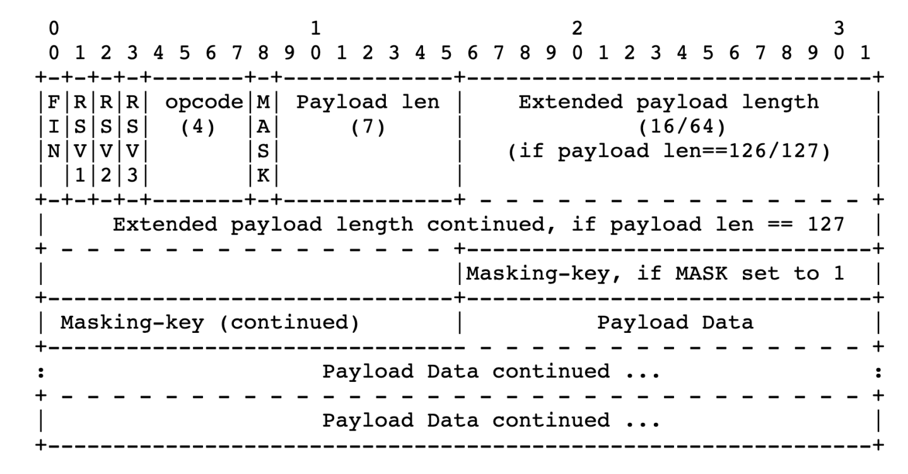
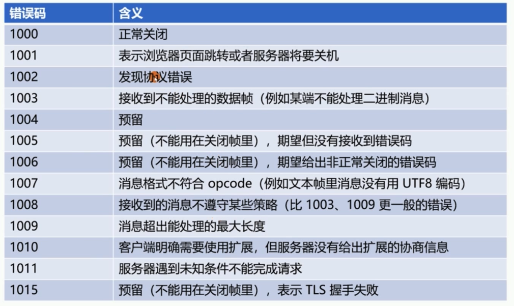

### 一、什么是websocket

`WebSocket`该协议在规范[RFC 6455中进行了描述，它提供了一种通过持久连接在浏览器和服务器之间交换数据的方法。](http://tools.ietf.org/html/rfc6455)数据可以作为“数据包”双向传递，而无需中断连接或发出额外的 HTTP 请求。

为啥不用HTTP1.1 呢，HTTP1.1的双向通信只能通过轮询，会浪费很多网络资源，因为每次都需要tcp的三次握手以及四次挥手。而且HTTP1.1不能从server到client 进行消息推送，消息的实时性得不到保证。

### 二、websocket 的用途

WebSocket 特别适合需要连续数据交换的服务。例如，网络游戏和实时交易系统。

WebSocket 在网络会议里有广泛应用：可以用作网络会议前检查人数的计数器或者用作会议期间发送材料和文件的平台，会议期间的发言内容

### 三、websocket 特点

1. 双向通信：优劣，优点是消息的实时性，缺点是伸缩性非常差比如增加服务器
2. 管理会话：双向关闭会话
3. 维持长链接：websocket 是通过ping，pong 发心跳维持长链接而.http1.1 是通过keeplive 
4. 兼容HTTP协议：端口复用 ws 是80端口，wss 是443 端口
5. 支持扩展：如per message-deflate 扩展
6. Http 协议头部存放元数据,websocket 传输的应用层存放元数据
7. 是基于帧而不是基于流（HTTP，TCP）每一帧要么承载字符数据要么承载二进制数据
8. 基于浏览器的同源策略模型（非浏览器无效）可以使用Access-Control-Allow-Origin 等头部
9. 基于URI、子协议支持同主机同端口上的多个服务、  

### 四、websocket 帧



1. RSV1、RSV2、RSV3 ：默认为0，仅当使用extension 扩展时，有扩展决定其值9

2. opcode 是帧的类型：持续帧 0 继续前一帧，非控制帧 1 是文本帧（UTF8）2 二进制帧 3-7 为非控制帧保留，控制帧

   8关闭帧 9 心跳帧ping A 心跳帧pong B-F 为控制帧保留

3. FIN 表示消息的结尾

4. 消息长度内容长度：消息长度由应用消息长度和扩展数据长度组成，<=125 字节仅使用Payload len，126 至2^16-1 字节

   Payload len值为126  Extended payload length 16 位表示长度。2^16 至 2^64-1 Payload len 值为127   Extended payload length 共8字节64位表示长度

5、frame-masking-key 掩码：客户端消息：MASK 为1（包括控制帧），传递32位无法预测的、随机的Masking-key.服务器端消息：MASK 为0 ，可以防止缓存代理污染攻击

它是如何做到的呢强制浏览器执行以下方法：

生成随机的32位frame-masking-key,不能让JS 代码猜出（否则可以反向构造）

对传输的包体按照frame-masking-key 执行可对称解密的XOR异或操作，使代理服务器不识别

6、心跳帧可以插在数据帧中传输：ping 帧 opcode=9 可以包含数据  pong 帧 opcode=A 必须与ping帧数据相同

### 五、websocket URL 格式

ws-URL= "ws:" "//"  host [":"port] path ["?" query]  默认port 端口80

wss-URL="wss:" "//"  host [":"port] path ["?" query]  默认port 端口443

客户端提供信息

1、host 与 port  主机名与端口

2、shame:是否基于SSL

3、访问资源：URL

4、握手随机数：Sec-websocket-key

5、选择子协议：Sec-websocket-Protocol

6、扩展协议：Sec-websocket-Extensions

7、CORS 跨域：Origin

### 六、发送消息

1. 确保WebSocket 会话处于OPEN状态
2. 以帧来承载消息，一条消息可以拆分多个数据帧
3. 客户端发送的帧必须基于掩码编码
4. 一旦发送或者接收到关闭帧，链接处于CLOSING 状态
5. 一旦发送了关闭帧，且接收到了关闭帧，链接处于CLOSED 状态
6. TCP 连接关闭后，WebSocket 连接才完全被关闭

### 七、关闭会话的方式

控制帧中的关闭帧：在TCP连接上的双向关闭，发送关闭帧后，不能再发送任何数据。接收到关闭帧后，不再接收任何到达的数据

关闭帧可以含有数据，但仅用于解释关闭会话的原因，前2字节为无符号整型，遵循mask 掩码规则

### 八、关闭帧错误码



### 九、简单的websocket 代码

server

```go
http.HandleFunc("/ws", func(writer http.ResponseWriter, request *http.Request) {
   //http 请求升级为websockt 请求
   u := websocket.Upgrader{
      CheckOrigin: func(r *http.Request) bool {
         return true
      },
   }
   c, err := u.Upgrade(writer, request, nil)
   if err != nil {
      return
   }
   defer c.Close()
   done := make(chan struct{})
  // 从客户端接收消息
   go func() {
      for {
         m := make(map[string]interface{})
         err := c.ReadJSON(&m)
         if err != nil {
            fmt.Printf("connot read json:%v\n", err)
            done <- struct{}{}
            break
         }
         fmt.Println(err)
      }

   }()
   // 发送消息到客户端
   i := 0
   for {
      i++
      err := c.WriteJSON(map[string]string{
         "hello":  "websocket",
         "msg_id": strconv.Itoa(i),
      })
      if err != nil {
         fmt.Println(err)
      }
      select {
      case <-time.After(200 * time.Millisecond):
      case <-done:
         return
      }
      time.Sleep(1 * time.Second)
   }

})
http.ListenAndServe(":8081", nil)
```

client

```js
<script>
    var ws = new WebSocket("ws://localhost:8081/ws")
		ws.open = function (evt){
      ws.send("dfsffdsdf")
    }
    ws.onmessage = function (evt){
        console.log(evt.data)
    }
</script>
```