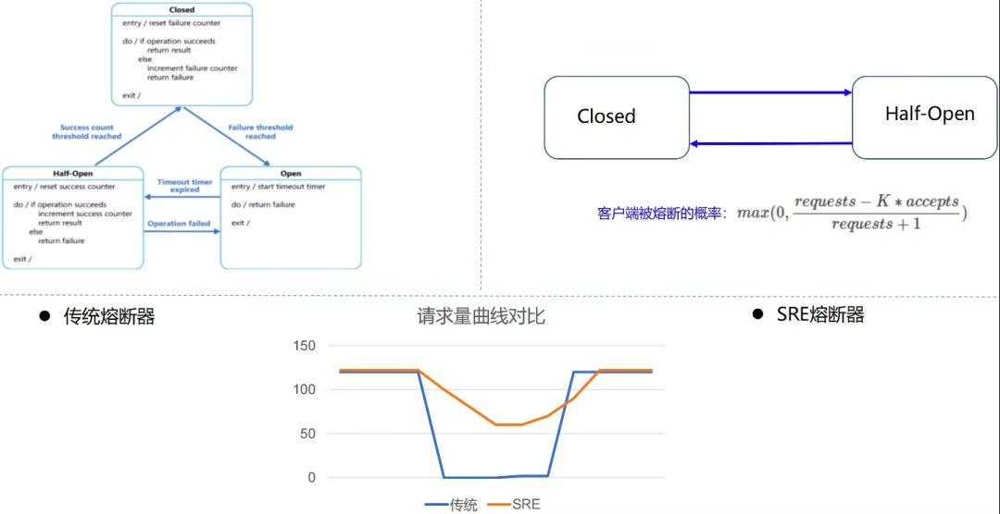

### 前言

当某个用户超过资源配额时，后端任务应该迅速拒绝该请求，返回一个“用户配额不足”类型的错误，该回复应该比真正处理该请求所消耗的资源少得多。然而，这种逻辑其实不适用于所有请求。例如，拒绝一个执行简单内存查询的请求可能跟实际执行该请求消耗内存差不多（因为这里主要的消耗是在应用层协议解析中，结果的产生部分很简单）。

就算在某些情况下，拒绝请求可以节省大量资源，发送这些拒绝回复仍然会消耗一定数量的资源。如果拒绝回复的数量也很多，这些资源消耗可能也十分可观。在这种情况下，有可能该后端在忙着不停地发送拒绝回复时一样会进人过载状态。

那么客户端截流机制就可以解决这个问题，也就是Google SRE

### 一、什么是Google SRE

是否可以做到在熔断器 Open 状态下（但是后端未 Shutdown）**仍然可以放行少部分流量**呢？Google SRE 熔断器提供了一种算法：**客户端自适应限流（client-side throttling）。**

解决的办法就是**客户端自行限制请求速度，限制生成请求的数量**，超过这个数量的请求直接在本地回复失败，而不会真正发送到服务端。

该算法统计的指标依赖如下两种，每个客户端记录过去两分钟内的以下信息（一般代码中以滑动窗口实现）。

- **requests**：客户端请求总量
  - 注：The number of requests attempted by the application layer(at the client, on top of the adaptive throttling system)
- **accepts**：成功的请求总量 - 被 accepted 的量
  - 注：The number of requests accepted by the backend

### 二、Google SRE 熔断器的工作流程：

- 在通常情况下（无错误发生时） requests == accepts ；
- 当后端出现异常情况时，accepts 的数量会逐渐小于 requests；
- 当后端持续异常时，客户端可以继续发送请求直到 requests = K∗accepts，一旦超过这个值，客户端就启动自适应限流机制，新产生的请求在本地会被概率（以下称为p）丢弃；
- 当客户端主动丢弃请求时，requests 值会一直增大，在某个时间点会超过 K∗accepts，使 p 计算出来的值大于 0，此时客户端会以此概率对请求做主动丢弃；
- 当后端逐渐恢复时，accepts 增加，（同时 requests 值也会增加，但是由于 K 的关系，K*accepts的放大倍数更快），使得 (requests − K×accepts) / (requests + 1) 变为负数，从而 p == 0，客户端自适应限流结束。

客户端请求被拒绝的概率（Client request rejection probability，以下简称为 p）

p 基于如下公式计算（其中 K 为倍率 - multiplier，常用的值为 2）。


- 当 requests − K∗accepts <= 0 时，p == 0，客户端不会主动丢弃请求；
- 反之， p 会随着 accepts 值的变小而增加，即成功接受的请求数越少，本地丢弃请求的概率就越高。

客户端可以发送请求直到 requests = K∗accepts， 一旦超过限制， 按照 p 进行截流。

对于后端而言，调整 K 值可以使得自适应限流算法适配不同的服务场景

- **降低 K 值会使自适应限流算法更加激进**（允许客户端在算法启动时拒绝更多本地请求）；
- **增加 K 值会使自适应限流算法变得保守一些**（允许服务端在算法启动时尝试接收更多的请求，与上面相反）。



熔断本质上是一种快速失败策略。旨在通过及时中断失败或超时的操作，防止资源过度消耗和请求堆积，从而**避免服务因小问题而引发的雪崩效应。**

### 三、Google SRE GRPC 代码实现

我们要考虑几个问题，第一个问题用什么哪种算法去做统计呢，我感觉用滑动窗口去统计比较合适，因为滑动窗口是统计一个周期内的请求以及响应.用户的响应也是随着周期性的变化的。

第二个问题是此算法在什么时候执行呢，就拿GRPC 来说，当然是拦截器呢，在发送后端服务请求的时候前就要去是否要熔断，避免错误的请求发送到后端

```go
type googleSlide struct {
   sreSlide *list.List
   interval int64
   mutex    sync.Mutex
   k        int64
}

type slideVal struct {
   time   int64
   req    int64
   accept int64
}

type SlideValOptions func(val *slideVal)

func NewSlideval(options ...SlideValOptions) *slideVal {
   t := &slideVal{
      time: time.Now().UnixNano(),
   }
   for _, option := range options {
      option(t)
   }
   return t
}

func WithReqOption(req int64) SlideValOptions {
   return func(val *slideVal) {
      val.req = req
   }
}

func WithAcceptReqOption(accept int64) SlideValOptions {
   return func(val *slideVal) {
      val.accept = accept
   }
}

func NewGoogleSlide(interval time.Duration, k int64) *googleSlide {
   return &googleSlide{
      sreSlide: list.New(),
      interval: interval.Nanoseconds(),
      k:        k,
   }
}

func (g *googleSlide) Sre() grpc.UnaryClientInterceptor {
	return func(ctx context.Context, method string, req, reply any, cc *grpc.ClientConn, invoker grpc.UnaryInvoker, opts ...grpc.CallOption) error {
		g.mutex.Lock()
		now := time.Now().UnixNano()
		front := g.sreSlide.Front()
		for front != nil && front.Value.(*slideVal).time+g.interval < now {
			g.sreSlide.Remove(front)
			front = g.sreSlide.Front()
		}
		var r, accept int64
		front = g.sreSlide.Front()
		for front != nil {
			t := front.Value.(*slideVal)
			r += t.req
			accept += t.accept
			front = front.Next()
		}
		tail := (float64(r) - float64(g.k*accept)) / (float64(r) + 1)
		if tail > 0 {
			g.mutex.Unlock()
			return errors.New("request is fail")
		}
		g.sreSlide.PushBack(NewSlideval(WithReqOption(1)))
		err := invoker(ctx, method, req, req, cc, opts...)
		if err == nil {
			g.sreSlide.PushBack(NewSlideval(WithAcceptReqOption(1)))
		}
		g.mutex.Unlock()
		return err
	}
}
```

Testing 用例

模拟客户端请求，handler 是正常的请求，handler1是返回有问题的请求，2 客户端熔断器的参数. 此值越小越激进，对服务端错误的容忍越小.

```golang
func TestGoogleSre(t *testing.T) {
   slide := NewGoogleSlide(5*time.Second, 2)
   builder := slide.Sre()
   handler := func(ctx context.Context, method string, req, reply any, cc *grpc.ClientConn, opts ...grpc.CallOption) error {
      return nil
   }
   handler1 := func(ctx context.Context, method string, req, reply any, cc *grpc.ClientConn, opts ...grpc.CallOption) error {
      return errors.New("network is dial")
   }
   err := builder(context.Background(), "/test/a", &gen.GetByIdReq{}, &gen.GetByIDResp{}, nil, handler)
   assert.NoError(t, err)
   err = builder(context.Background(), "/test/a", &gen.GetByIdReq{}, &gen.GetByIDResp{}, nil, handler1)
   assert.Equal(t, err, errors.New("network is dial"))
   err = builder(context.Background(), "/test/a", &gen.GetByIdReq{}, &gen.GetByIDResp{}, nil, handler1)
   assert.Equal(t, err, errors.New("network is dial"))
   err = builder(context.Background(), "/test/a", &gen.GetByIdReq{}, &gen.GetByIDResp{}, nil, handler1)
   assert.Equal(t, err, errors.New("request is fail"))
   err = builder(context.Background(), "/test/a", &gen.GetByIdReq{}, &gen.GetByIDResp{}, nil, handler1)
   assert.Equal(t, err, errors.New("request is fail"))
   time.Sleep(5 * time.Second)
   err = builder(context.Background(), "/test/a", &gen.GetByIdReq{}, &gen.GetByIDResp{}, nil, handler)
   assert.NoError(t, err)
}
```