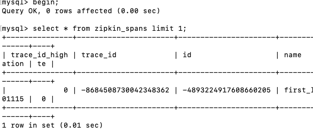
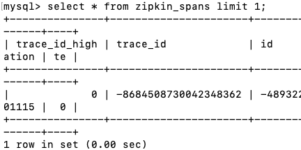
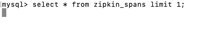
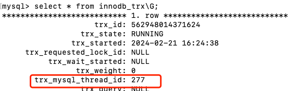

### 前言

为什么要设计锁，锁设计初衷是为了解决多线程下并发问题。出现并发的时候用锁进行数据同步，避免因并发造成了数据错误(数据覆盖)。可见锁的重要性，并不是所有的数据库都有锁。比如Redis，单个操作是原子性的，并且是单线程的，并发请求会在队列排列，请求是按顺序执行的，就不需要锁。Mysql 需要锁，mysql 是多线程的，并发操作要保证数据的一致性，需要通过锁进行数据同步。根据锁的范围来讲，mysql 的锁分为全局锁、表级锁和行锁

### 一、全局锁

全局锁就是对整个数据库实例加锁。Msql 提供的加全局锁的方法，命令是 Flush tables with read lock (FTWRL)，以及set global readonly=true那么整库是只读状态，那么对数据库的DDL 以及 DML 将被阻塞，数据库将报下列错误。

全局锁主要是用在全库逻辑备份。这个命令产生以下风险：如果你在主库上备份，那么备份期间不能执行更新，如果在从库上备份，备份期间从库不能执行主库同步过来的binlog，会导致主从延迟。

我们在想想备份为什么要加锁，一定要加锁吗。答案是肯定的，必须的。加锁是为了保证数据的一致性以及业务的完整性。

我们现在有一个订单表，有一个余额表。有用户购买一个产品，业务逻辑是先扣除余额，然后往订单插一条数据。业务期间我们开始备份，在扣除余额前开始备份。恢复数据时候我们发现，用户的余额没有减少，但是用户多了一个订单。是不是不可以呀，所以备份前需要加锁的。加全局锁会影响业务，也是不可取的，有没有其他方法呢。

可以用官方自带的逻辑备份工具mysqldump，当在mysqldump使用参数–single-transaction 的时候，导数据前会启动一个事物，这个事物的隔离级别必须是RR，来确保拿到了一致性视图。由于MVCC 支持，数据库的DML 正常的处理。这种方法需要使用事务引擎的库，MyISAM就不可以。

MyISAM备份还是需要使用FTWRL的。有人说用set global readonly=true也可以让全库只读，可以不，当然也是可以的。他们之间有什么区别呢。一是，修改global变量的方式影响面非常大，readonly会被用来做其他逻辑，比如用来判断一个库是主库还是备库 二是，在异常处理机制的差异。如果客户端异常断开时使用FTWRL会自动释放全局锁，整个库可以正常更新。使用readonly整个库依旧处于只读状态，不能更新。

### 二、表级锁

在mysql 提供了两种表级别的锁：一种是表锁，二种是元数据锁（meta data lock，MDL)。表锁的语法是 lock tables … read/write，用这种方法的话可以用unlock 去释放锁，也可以客户端断开时自动释放。lock 的影响面很大不仅影响其他线程的write/read,write,本线程接下来的write/也会影响。这种方法毕竟对业务的影响很大，并不常用。

MDL锁，不需要用户显示使用，是mysql 内部的一种机制。当我们对数据表DML时，系统会自动加上MDL读锁，防止用户DDL操作，产生不一致性。当我们对数据表DDL时，系统会自动加上MDL写锁，防止用户DML操作以及其他线程的MDL操作避免数据不一致。

多说一句MDL是一个两阶段锁，在事务开始时加锁，事物结束时释放锁。在这个地方可以给大家解释下，session A , session B , session C, session D 是几个客户端

Session A  

此时表加了一个MDL 读锁，事务还没有结束一直保留着MDL 读锁，直到commit 或者 rollback

Session B

此时表加了一个MDL 读锁,读锁之间可以共享

Session C

此时表加了一个MDL 写锁，读锁和写锁之间是互斥的所以阻塞

Session D

此时表加了一个MDL 读锁，由于Session C 被阻塞了所以 Session D也不阻塞了

由此我们可以确定MDL 锁的生命周期是从事务开始到事务提交。上面在解释一下Session D也是MDL读锁为啥也被阻塞了，Session C被阻塞后，后面客户端对表的MDL锁都会放到队列里，当事务提交后，依次从队列取出执行

如何安全的给表修改字段呢？

事务不提交，就会一直占着MDL锁。在 MySQL 的 information_schema 库的 innodb_trx 表中，你可以查到当前执行中的事务。如果你要做 DDL 变更的表刚好有长事务在执行，要考虑先暂停 DDL，或者 kill 掉这个长事务。

下面是如何kil 一个事物

一、在 information_schema 库的 innodb_trx 中找到一个事物id ，然后执行kill 就可以了

如果业务很重要或者表一直有数据更新，那么这种方法不可以了。需要用

ALTER TABLE tbl_name NOWAIT add column ...
ALTER TABLE tbl_name WAIT N add column ... 

这种方法，失败了重试，知道成功 。MariaDB 已经合并了 AliSQL 的这个功能，所以这两个开源分支目前都支持 DDL NOWAIT/WAIT n 这个语法。

有人问我mysql 5.6不是支持online ddl了吗？还会有阻塞吗，其实会的。online ddl 执行过程是这样的分为以下几步：

1. 拿MDL写锁 
2. 降级成MDL读锁 
3. 真正做DDL 
4.  升级成MDL写锁 
5. 释放MDL锁 

1、2、4、5如果没有锁冲突，执行时间非常短。第3步占用了DDL绝大部分时间，这期间这个表可以正常读写数据，是因此称为“online ” 

我们的例子第一步就锁住了

### 三、行锁

行锁住要讨论的是innodb引擎下机制，myisam 不支持行锁，也就不支持并发，也就意味着myisam的更新是表级锁。

在 InnoDB 事务中，行锁是在需要的时候才加上的，但并不是不需要了就立刻释放，而是要等到事务结束时才释放。这个就是两阶段锁协议。

这个机制非常重要，为我们在业务设计中减少锁的冲突提供了理论的支持。那就是说如果你的事务中需要锁多个行，要把最可能造成锁冲突、最可能影响并发度的锁尽量往后放。

既然是有锁，对于我们业务开发会不会造成死锁呢，答案是肯定的，什么事死锁呢？

当并发系统中不同线程出现循环资源依赖，涉及的线程都在等待别的线程释放资源时，就会导致这几个线程都进入无限等待的状态，称为死锁。

当出现死锁后，有两种策略解决死锁：

1. 一种策略是，直接进入等待，直到超时。这个超时时间可以通过参数 innodb_lock_wait_timeout 来设置。
2. 另一种策略是，发起死锁检测，发现死锁后，主动回滚死锁链条中的某一个事务，让其他事务得以继续执行。将参数 innodb_deadlock_detect 设置为 on，表示开启这个逻辑。

在 InnoDB 中，innodb_lock_wait_timeout 的默认值是 50s，意味着如果采用第一个策略，当出现死锁以后，第一个被锁住的线程要过 50s 才会超时退出，然后其他线程才有可能继续执行。对于在线服务来说，这个等待时间往往是无法接受的。如果值设置的太小那么正常的逻辑也有可能受到影响。

innodb_deadlock_detect 这个是有负担的，试想100个线程更新一条记录，那么就有100*100 个量级死锁检测，表的行数越多，会消耗大量的cpu 资源。如果关掉呢，又会一直死锁，直到超时，会影响业务。

那么怎么解决这样的问题呢？

以上两种方案，减少innodb_lock_wait_timeout时间以及 innodb_deadlock_detect=on都是不可取的，那么我们通过减少连接线程去减少并发从儿达到减少死锁，后来发现这种方案也是不可靠的，第一、客户端的数量没法控制 第二、减少线程意味着系统的性能得不到完全利用。也只能从业务上去考虑呢，根据不同业务，把更新一行放到多行上，锁的粒度变小了，死锁就减少了。通过这些我们总结一个结论，提高系统性能往往需要从业务本身去考虑，选择合适的存储方式。