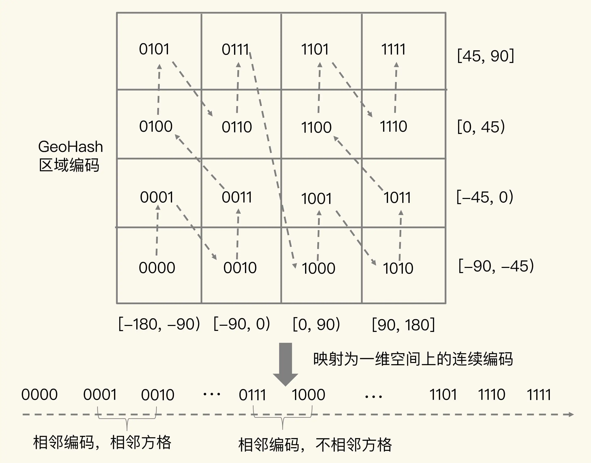

### 前言

我们有一个需求是用户搜索附近的店铺，就是所谓的位置信息服务（Location-Based Service，LBS）的应用。这样的相关服务我们每天都在接触，用滴滴打车，中午去美团订外卖等等。当我们用这些服务方便我们的生活的时候，大家有没有想过是怎么实现的。目前市场上很多软件比如Es，Redis 都提供了类似的功能，他们底层都是用的GeoHash 编码，只不过底层的数据结构不同。今天主要讲的是Redis 的 Geo 如何实现这个功能

### 一、GeoHash 的编码方法

Redis 常用的数据类型有String（字符串）、List（列表）、Hash（哈希）、Set（集合）和 Sorted Set（有序集合）。位置信息存储一定是key，value，value 就是经纬度。用List、Hash，Set 去存储，没有办法去排序，当然也是不可以的。最接近的数据结构是Sorted Set，可以根据score 排序同时也满足范围获取。又有一个问题是 score 是 float 类型的,经纬度不是的，好像也不可以，能不能用一种编码把经纬度变成float 类型的，这种编码就是GeoHash。

为了能高效地对经纬度进行比较，Redis 采用了业界广泛使用的 GeoHash 编码方法，这个方法的基本原理就是“二分区间，区间编码”。当我们用GeoHash编码时，我们要先对经度和维度分别编码，然后再把经纬度各自的编码组合成一个最终编码。

我们看看经纬度的编码过程。

对于一个定理信息来说，它的经度范围是[-180,180]，纬度范围是[-90,90]。GeoHash编码会把经，纬度做N次二分区操作，其中N是自定义的。

先拿经度来说，范围是[-180,180]会被分成两个子区间：【-180,0)和【0,180】(我称为左右分区)。此时我们要看下经度是落在左右哪个分区上，落在左分区用0表示，又分区用1 表示。第二次在把落在的分区又分成左右两个分布，在看下经度是落在哪个分区上，落在左分区用0表示，又分区用1 表示。依次类推，只要分成了N份结束了。最终得到的是N bit 的位数，例如10111 这样的数据。

纬度也是同样的，只不过，纬度的范围是【-90,90】。每次也是平均分成左右两个分区，落在左分区用0表示，又分区用1 表示。最终得到的也是N bit 的位数，例如10110 这样的数据。

最终得倒的是2个N bit 的位数，最终进行组合。组合规则是第 0 位是经度的第 0 位 1，第 1 位是纬度的第 0 位 1，第 2 位是经度的第 1 位 1，第 3 位是纬度的第 1 位 0。

下面我们会举一个例子，来阐述算法具体的实现：经度值 116.37，纬度值 39.86， N是5。

经度分区过程 116.37：

| 分区次数 | 左分区         | 右分区       | 经度116.37所在的分区 | 编码 |
| :------: | -------------- | ------------ | -------------------- | ---- |
|    1     | 【-180,0)      | [0,180]      | [0,180]              | 1    |
|    2     | [0,90)         | [90,180]     | [90,180]             | 1    |
|    3     | [90,135)       | [135,180]    | [90,135)             | 0    |
|    4     | [90,112.5)     | [112.5,135]  | [112.5,135]          | 1    |
|    5     | [112.5,123.75) | [123.75,135] | [112.5,123.75)       | 0    |

最终编码是11010

纬度的编码过程是 39.86

| 分区次数 | 左分区         | 右分区      | 纬度 39.86所在的分区 | 编码 |
| :------: | -------------- | ----------- | -------------------- | ---- |
|    1     | 【-90，0）     | 【0,90]     | 【0,90]              | 1    |
|    2     | [0,45)         | [45,90]     | [45,90]              | 0    |
|    3     | [0,22.5)       | [22.5,45]   | [22.5,45]            | 1    |
|    4     | [22.5,33.75)   | [33.75,45]  | [33.75,45]           | 1    |
|    5     | [33.75,39.375) | [39.375,45] | 39.375,45]           | 1    |

最终编码是 10111

GeoHash最终编码是，回顾编码规则：组合规则是第 0 位是经度的第 0 位 1，第 1 位是纬度的第 0 位 1，第 2 位是经度的第 1 位 1，第 3 位是纬度的第 1 位 0

| 经度编码       | 1    |      | 1    |      | 0    |      | 1    |      | 0    |      |
| -------------- | ---- | ---- | ---- | ---- | ---- | ---- | ---- | ---- | ---- | ---- |
| 奇偶数（位数） | 0    | 1    | 2    | 3    | 4    | 5    | 6    | 7    | 8    | 9    |
| 纬度编码       |      | 1    |      | 0    |      | 1    |      | 1    |      | 1    |

经度编码和纬度编码合并：一共是10位数， 1110011101，位数不要错了，这个最终就是 Sorted Set 的 sort 值了。

当然，使用 GeoHash 编码后，我们相当于把整个地理空间划分成了一个个方格，每个方格对应了 GeoHash 中的一个分区。举个例子。我们把经度区间[-180,180]做一次二分区，把纬度区间[-90,90]做一次二分区，就会得到 4 个分区。我们来看下它们的经度和纬度范围以及对应的 GeoHash 组合编码。分区一：[-180,0) 和[-90,0)，编码 00；分区二：[-180,0) 和[0,90]，编码 01；分区三：[0,180]和[-90,0)，编码 10；分区四：[0,180]和[0,90]，编码 11。

这 4 个分区对应了 4 个方格，每个方格覆盖了一定范围内的经纬度值，分区越多，每个方格能覆盖到的地理空间就越小，也就越精准。我们把所有方格的编码值映射到一维空间时，相邻方格的 GeoHash 编码值基本也是接近的，如下图所示：

所以，我们使用 Sorted Set 范围查询得到的相近编码值，在实际的地理空间上，也是相邻的方格，这就可以实现 LBS 应用“搜索附近的人或物”的功能了。不过，我要提醒你一句，有的编码值虽然在大小上接近，但实际对应的方格却距离比较远。例如，我们用 4 位来做 GeoHash 编码，把经度区间[-180,180]和纬度区间[-90,90]各分成了 4 个分区，一共 16 个分区，对应了 16 个方格。编码值为 0111 和 1000 的两个方格就离得比较远，如下图所示：

### 二、操作GEO类型

在使用 GEO 类型时，我们经常会用到两个命令，分别是 GEOADD 和 GEORADIUS。

GEOADD 命令：用于把一组经纬度信息和相对应的一个 ID 记录到 GEO 类型集合中；

GEORADIUS 命令：会根据输入的经纬度位置，查找以这个经纬度为中心的一定范围内的其他元素。当然，我们可以自己定义这个范围。

操作如下：

GEOADD 如果member 没有就增加，有就是修改，用 GEOPOS cars:locations 33 可以看到每个member 具体的经纬度

GEORADIUS 可以根据坐标找到相应的member。命令的详解可以看官网文档 https://redis.io/commands/georadius/

非常感谢  蒋德钧的《Redis 核心技术与实战》以及 redis 官网提供了非常宝贵的资料