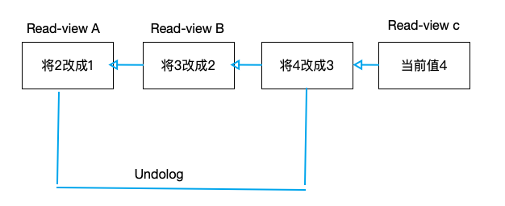

### 前言

提到事务，大家肯定不陌生。在我们现实生活中也是存在的，比如我们去超市购物，然后去支付。虽然是两个步骤，必须保证同时成功，这个交易才可以完成。

如果这个场景，拿到我们购物系统，就是几张表订单表、支付表、流水表。你往订单表插入一条数据，同时也会往支付表，流水表拆入一条数据，这个插入操作必须同时成功。这就是事务，简单来说事务就是要保证一组数据库操作，要么全部成功，要么全部失败。在mysql 中，事务支持是在引擎层实现的。并不是所有的引擎都支持事务，比如说Innodb 支持而myisam不支持，这也是Innodb取代myisam的原因。

不仅mysql 支持事务，很多数据、库 Mongodb也支持，虽然他们实现的方式不一样，我会在接下来的文章详细阐述。今天我们主要讲的是mysql 事务。

### 隔离性与隔离级别

一个数据系统支不支持事务，主要有四大特性决定的，ACID（Atomicity、Consistency、Isolation、Durability，即原子性、一致性、隔离性、持久性）。只要支持四大特性，我们就说系统支持事务。

大家要去了解这几个特性，首先必须明白mysql 的几种日志：redolog(重做日志),binlog(归档日志),undolog(回滚日志)

Atomicity（原子性）：一个事务（transaction）中的所有操作，或者全部完成，或者全部不完成，不会结束在中间某个环节。事务在执行过程中发生错误，会被回滚（Rollback）到事务开始前的状态，就像这个事务从来没有执行过一样。即，事务不可分割、不可约简。是通过redolog和undolog实现的

Consistency（一致性）：在事务开始之前和事务结束以后，数据库的完整性没有被破坏。这表示写入的资料必须完全符合所有的预设约束、触发器、级联回滚等。

Isolation（隔离性）：数据库允许多个并发事务同时对其数据进行读写和修改的能力，隔离性可以防止多个事务并发执行时由于交叉执行而导致数据的不一致。事务隔离分为不同级别，包括未提交读（Read uncommitted）、提交读（read committed）、可重复读（repeatable read）和串行化（Serializable）。 是通过undolog 实现的

Durability（持久性）：事务处理结束后，对数据的修改就是永久的，即便系统故障也不会丢失。 是通过redlog 和 binlog 实现的

当数据库多个事物同时执行的时候，就可能出现脏读（dirty read）、不可重复读（non-repeatable read）、幻读（phantom read）的问题。

脏读：读到其他事物未提交的数据

不可重复读：同一个事物前后读到的数据内容不一致

幻读：前后读取的记录数量不一致。也就是说感知到了其他事物对数据的insert，delete 操作

为啥会有那么多的问题，主要是于事物的隔离级别有关

事务有以下几种隔离级别：

读未提交（read uncommitted）：一个事务还没提交时，它做的变更就能被别的事务看到。

读提交（read committed）：一个事务提交之后，它做的变更才会被其他事务看到。

可重复读（repeatable read）：一个事务执行过程中看到的数据，总是跟这个事务在启动时看到的数据是一致的。当然在可重复读隔离级别下，未提交变更对其他事务也是不可见的。

串行化（serializable）：顾名思义是对于同一行记录，“写”会加“写锁”，“读”会加“读锁”。当出现读写锁冲突的时候，后访问的事务必须等前一个事务执行完成，才能继续执行。

读提交和可重复读比较难以理解，这两种隔离级别也是用的最多的。他们的实现都与一种技术（mvcc）有关，关于这个话题，我会在接下来的文章继续阐述。读提交他解决了脏读的问题，可重复度解决了事务的不可重复度的问题，同时它通过间隙锁解决了幻读的问题。其他的两种隔离级别都没有用到mvcc，读未提交会产生大量的脏数据，用的少。串行化性能太低，事务串行化执行，并发下的效率。接下来我们将通过例子详细阐述这几种隔离级别。

有这样一个表

```sql
mysql> create table T(c int) engine=InnoDB;
insert into T(c) values(1);
```

读未提交

|           事务A            |    事务B    |
| :------------------------: | :---------: |
| 启动事务 <br />查询得到值1 |  启动事务   |
|                            | 查询得到值1 |
|                            |  将1改成2   |
|       查询得到值V1=2       |             |
|                            |  提交事务B  |
|       查询得到值v2=2       |             |
|         提交事务A          |             |
|       查询得到值v3=2       |             |

通过上面的例子可以看到事务B还没有提交，事务A就看到了结果

读提交

|           事务A            |    事务B    |
| :------------------------: | :---------: |
| 启动事务 <br />查询得到值1 |  启动事务   |
|                            | 查询得到值1 |
|                            |  将1改成2   |
|       查询得到值V1=1       |             |
|                            |  提交事务B  |
|       查询得到值v2=2       |             |
|         提交事务A          |             |
|       查询得到值v3=2       |             |

通过上面的例子可以看到事务B提交后，事务A就可以看到事务B提交的数据

可重复度

|           事务A            |    事务B    |
| :------------------------: | :---------: |
| 启动事务 <br />查询得到值1 |  启动事务   |
|                            | 查询得到值1 |
|                            |  将1改成2   |
|       查询得到值V1=1       |             |
|                            |  提交事务B  |
|       查询得到值v2=1       |             |
|         提交事务A          |             |
|       查询得到值v3=2       |             |

通过上面的例子可以事务在执行期间看到的数据前后必须是一致的。在事务A中v2和v1的数据和它查询的数据保持一致

串行化（serializable）

|           事务A            |    事务B    |
| :------------------------: | :---------: |
| 启动事务 <br />查询得到值1 |  启动事务   |
|                            | 查询得到值1 |
|                            |  将1改成2   |
|       查询得到值V1=1       |             |
|                            |  提交事务B  |
|       查询得到值v2=1       |             |
|         提交事务A          |             |
|       查询得到值v3=2       |             |

通过上面的例子：事务 B 执行“将 1 改成 2”的时候，会被锁住。直到事务 A 提交后，事务 B 才可以继续执行。所以从 A 的角度看， V1、V2 值是 1，V3 的值是 2。也就是说事务A执行完了事务B才开始执行

在实现上，数据库会在读提交和可重复度隔离级别下创建一个视图，访问的时候以视图的逻辑结果为准。在可重复读隔离级别下，这个视图是在事务启动时创建的，整个事务存在期间都用这个视图。在“读提交”隔离级别下，在每个sql 语句开始执行的时候创建的。读未提交每次都是返回记录最新的数据。串行化是用加锁的方式避免并发访问。

由此可见不同的隔离级别，数据库的行为是不同的。大家应该选择数据库合适的隔离级别。mysql 默认的隔离级别是可重复读，oracle 默认的隔离级别是读提交。不过现在很多厂把mysql 的隔离级别改成读提交，这是为了减少锁冲突，可重复读为了解决幻读引入了复杂的锁机制。

可以通过下列方式查看数据库的隔离级别

`mysql> show variables like 'transaction_isolation';

ERROR 4031 (HY000): The client was disconnected by the server because of inactivity. See wait_timeout and interactive_timeout for configuring this behavior.

No connection. Trying to reconnect...

Connection id:  283

Current database: zipkin

+-----------------------+-----------------+

| Variable_name     | Value      |

+-----------------------+-----------------+

| transaction_isolation | REPEATABLE-READ |

+-----------------------+-----------------+

1 row in set (0.07 sec)`

可重复读的隔离级别也不是没有人用，试想下面的场景：

假设你在管理一个个人银行账户表。一个表存了账户余额，一个表存了账单明细。到了月底你要做数据校对，也就是判断上个月的余额和当前余额的差额，是否与本月的账单明细一致。你一定希望在校对过程中，即使有用户发生了一笔新的交易，也不影响你的校对结果。

这时候使用“可重复读”隔离级别就很方便。事务启动时的视图可以认为是静态的，不受其他事务更新的影响。

### 事务隔离的实现

在mysql 中，实际上每条记录在更新的时候都会记录一条回滚操作。记录上的最新值，通过回滚操作，都可以得到前一个状态的值。这些数据通过事务id记录在undolog中，这就是所谓的回滚日志



当前值是 4，但是在查询这条记录的时候，不同时刻启动的事务会有不同的 read-view。如图中看到的，在视图 A、B、C 里面，这一个记录的值分别是 1、2、4，同一条记录在系统中可以存在多个版本，就是数据库的多版本并发控制（MVCC）。对于 read-view A，要得到 1，就必须将当前值依次执行图中所有的回滚操作得到。同时你会发现，即使现在有另外一个事务正在将 4 改成 5，这个事务跟 read-view A、B、C 对应的事务是不会冲突的。

你一定会问，回滚日志总不能一直保留吧，什么时候删除呢？答案是，在不需要的时候才删除。也就是说，系统会判断，当没有事务再需要用到这些回滚日志时，回滚日志会被删除。什么时候才不需要了呢？就是当系统里没有比这个回滚日志更早的 read-view 的时候。基于上面的说明，

我们来讨论一下为什么建议你尽量不要使用长事务。长事务意味着系统里面会存在很老的事务视图。由于这些事务随时可能访问数据库里面的任何数据，所以这个事务提交之前，数据库里面它可能用到的回滚记录都必须保留，这就会导致大量占用存储空间。在 MySQL 5.5 及以前的版本，回滚日志是跟数据字典一起放在 ibdata 文件里的，即使长事务最终提交，回滚段被清理，文件也不会变小。我见过数据只有 20GB，而回滚段有 200GB 的库。最终只好为了清理回滚段，重建整个库。除了对回滚段的影响，长事务还占用锁资源，也可能拖垮整个库，这个我们会在后面讲锁的时候展开。

### 事务的启动方式

1、显式启动事务语句， begin 或 start transaction。配套的提交语句是 commit，回滚语句是 rollback。这个时候事务并没有开始，事务的开始是它们之后的第一个操作 InnoDB 表的select 语句启动。如果想马上启动一个事物用start transaction with consistent snapshot这个命令

2、set autocommit=0，这个命令会将这个线程的自动提交关掉。意味着如果你只执行一个 select 语句，这个事务就启动了，而且并不会自动提交。这个事务持续存在直到你主动执行 commit 或 rollback 语句，或者断开连接。

有些客户端连接框架会默认连接成功后先执行一个 set autocommit=0 的命令。这就导致接下来的查询都在事务中，如果是长连接，就导致了意外的长事务。因此，我会建议你总是使用 set autocommit=1, 通过显式语句的方式来启动事务。

对于一个需要频繁使用事物的业务。我们可以用 commit work and chain 语法减少语句的交互次数，就会在提交的时候开始下一个事物，也省去了再次执行 begin 语句的开销

执行的事物都在 information_schema 库的 innodb_trx 我们可以用下列语句查询正在执行的事物。查询持续时间大于60s的事物，这个可以查询长事物

```sql
select * from information_schema.innodb_trx where TIME_TO_SEC(timediff(now(),trx_started))>60
```

这篇文章我们已经降到了事物，那么我们接下来思考几个问题：

1、使用长事务的弊病? 为什么使用常事务可能拖垮整个库?

1）长事务意味着系统里面会存在很老的事务视图。由于这些事务随时可能访问数据库里面的任何数据，所以这个事务提交之前，数据库里面它可能用到的回滚记录都必须保留，这就会导致大量占用存储空间。

2）长事务更容易导致死锁，会进行大量的死锁检测，消耗大量cpu，影响系统性能。关于死锁的话题可以阅读https://blog.csdn.net/xingjigongsi/article/details/136219867 这篇文章

3）容易造成超时，并使业务不断重试，使系统造成的很大的压力

4）会占用mysql 的连接，mysql 的连接得不到释放，会对业务的造成不好的影响

2、如何避免长事务的出现?

从数据库方面：    

a.设置autocommit=1，不要设置为0。  

  b.写脚本监控information_schemal.innodb_trx表中数据内容，发现长事务，kill掉它。  

  c.配置SQL语句所能执行的最大运行时间，如果查过最大运行时间后，中断这个运行事情长的SQL语句。   

 d.设置回滚表空单独存放，便于回收表空间。 

从业务代码方面：    

a.确认是否使用了autocommit=0的配置，如果有关闭它，然后再业务代码中手动的使用begin;commit来操作。   

 b.检查业务逻辑代码，能拆分为小事务的不要用大事务。   

 c.检查代码，把没有必要的select语句被事务包裹的情况去掉。