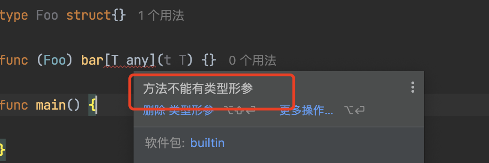

### 概念

Go 在1.18 中添加了泛型，这样Go 就可以在定义时不定义类型，而是在使用时进行类型的定义，并且还可以在编译期间对参数类型进行校验。Go 目前只支持泛型方法，还不支持泛型接口，下面我会详细介绍Go的泛型使用以及常见的使用错误。其他概念性的东西我不想说太多，大家可以自己百度。

我们先看一个例子，很简单就是从map[string]int 提出所有的键的函数：

```go
func getKeys(m map[string]int) []string {
    var keys []string
    for k := range m {
        keys = append(keys, k)
    }
    return keys
}
```

如果我们现在需要的是map[int]int，那么我们该怎么做呢？在使用泛型之前，Go 开发人员有几种选择：使用代码生成、反射或重复代码。例如，我们可以编写两个函数，每个函数对应一种 map 类型，或者甚至尝试扩展 getKeys 以接受不同的 map 类型：

```golang
func getKeys(m any) ([]any, error) {                      ❶
    switch t := m.(type) {
    default:
        return nil, fmt.Errorf("unknown type: %T", t)     ❷
    case map[string]int:
        var keys []any
        for k := range t {
            keys = append(keys, k)
        }
        return keys, nil
    case map[int]string:
        // Copy the extraction logic
    }
}
```

❶ 接受和返回一个interface{}

❷如果不是我们需要的类型，返回一个错误

通过这个例子，我们注意到了一些问题。首先，它增加了模版代码。事实上我们想增加一个case 时，需要重复range 循环。同时函数现在接受任意类型，这意味着我们失去了GO作为类型化语言的一些优势。事实上，检查类型是否支持是在运行时而不是编译时进行的。因此如果类型不合法，我们还需要返回错误。最后，由于key 的类型是int或者字符串，我们必须返回interface{} 的切片。如果对切片进行处理，还需要断言操作。这种方法增加了调用方的工作量。现在有了泛型，我们可以重构这段代码。

下面是泛型的基本语法

类型参数是我们可以与函数和类型一起使用的通用类型。例如，以下函数接受一个类型参数：

```golang
func foo[T any](t T) {     ❶
    // ...
}
```

❶ T 是类型参数

在调用 foo 时，我们传递一个任意类型的类型参数。提供类型参数称为实例化，这项工作在编译时完成。这样，类型安全就成了核心语言特性的一部分，而 避免了运行时的开销。

让我们回到 getKeys 函数，使用类型参数编写一个通用版本，它可以接受任何类型的映射：

```golang
func getKeys[K comparable, V any](m map[K]V) []K {   ❶
    var keys []K                                     ❷
    for k := range m {
        keys = append(keys, k)
    }
    return keys
}
```

❶ K 是可以比较的，value 是 interface{}

❷ 创建一个K slice

我们这么定义的原因是map 的key 必须是可以比较的类型，不能是 any。比如我们不能用slices:

```golang
var m map[[]byte]int
```

这段代码会导致编译错误：映射键类型 []byte 无效。因此，我们不能接受任何键类型，而必须限制类型参数，使键类型符合特定要求。这里的要求是键类型必须是可比较的（我们可以使用 == 或 !=）。因此，我们将 K 定义为可比类型，而不是任意类型。

限制类型参数以满足特定要求称为约束。约束是一种接口类型，可以包含:一组行为（方法）,任意类型
让我们举一个具体的例子来说明后者。假设我们不想接受任何可比较的映射键类型。例如，我们想将其限制为 int 或字符串类型。我们可以这样定义一个自定义约束：

```golang
type customConstraint interface {
    ~int | ~string                   ❶
}
func getKeys[K customConstraint,     ❷
         V any](m map[K]V) []K {
   
}
```

❶ 定义一个自定义类型，将类型限制为 int 和字符串
❷ 将类型参数 K 改为自定义约束类型

首先，我们定义了一个 customConstraint 接口，使用联合运算符 | 将类型限制为 int 或字符串（稍后我们将讨论 ~ 的使用）。现在，K 是一个 customConstraint，而不是之前的可比类型。

getKeys 的签名强制要求我们可以使用任何值类型的 map 调用它，但键类型必须是 int 或字符串--例如，在调用方：

```go
m = map[string]int{
    "one":   1,
    "two":   2,
    "three": 3,
}
keys := getKeys(m)
```

请注意，Go 可以推断出 getKeys 是以字符串类型参数调用的。之前的调用等同于此：

```golang
keys := getKeys[string](m)
```

### ~int vs .int

int 就是变量声明int 类型比如 var a int 而 ～int 指的是底层为int 类型，如 type b int , b 和 int 是两个不同的类型，但是b 的底层是int 类型

```golang
type customConstraint interface {
   ~int
   String() string
}
type customInt int

func (i customInt) String() string {
   return strconv.Itoa(int(i))
}
func getKeys[keys customConstraint, v any](m map[keys]v) {
   
}
func main() {
   t := customInt(1)
   getKeys(map[customInt]any{t: "a"})
}
```

由于 customInt 是一个 int 并实现了 String() 字符串方法，因此 customInt 类型满足已定义的约束。但是，如果我们将约束条件改为包含 int 而不是 ~int，那么使用 customInt 就会导致编译错误，因为 int 类型没有实现 String() 字符串。

到目前为止，我们已经讨论了在函数中使用泛型的示例。不过，我们也可以在数据结构中使用泛型。例如，我们可以创建一个包含任意类型值的链表。为此，我们将编写一个 Add 方法来追加一个节点：

```go
type Node[T any] struct {                ❶
    Val  T
    next *Node[T]
}
 
func (n *Node[T]) Add(next *Node[T]) {   ❷
    n.next = next
}
```

❶ 用一个类型参数

❷ 实例化一个类型接受者

在示例中，我们使用类型参数来定义 T，并在 Node 中使用这两个字段。关于方法，接收器是实例化的。事实上，由于 Node 是泛型的，它也必须遵循定义的类型参数。

**关于类型参数，最后需要注意的一点是，它们不能与方法参数一起使用，只能与函数参数或方法接收器一起使用。例如，下面的方法将无法编译：**



如果我们想在方法中使用泛型，那么接收器就必须是一个类型参数。现在，让我们来看看应该和不应该使用泛型的具体情况。

### 常见的用途和错误

讲到这里大家可能会问泛型如何使用呢，现在我们就讨论泛型几种常见的用途

1. 数据结构--例如，如果我们实现的是二叉树、链表或堆，我们可以使用泛型来确定元素类型。
2. 处理任何类型的切片、映射和通道的函数--例如，合并两个通道的函数可以处理任何类型的通道。因此，我们可以使用类型参数来确定通道类型：

比如在通道中我们对channel 类型进行限制了：

```go
type chantype interface {
   int | string
}

func merge1[T chantype](ch1, ch2 <-chan T) <-chan T {
   // ...
}
```

3.  例如，排序软件包包含一个 sort.Interface 接口，其中有三个方法：

   ```go
   type Interface interface {
       Len() int
       Less(i, j int) bool
       Swap(i, j int)
   }
   ```

该接口被不同的函数使用，如 sort.Ints 或 sort .Float64。我们该怎么做呢？很多时候我们可能会想到用interface{} 抽象然后断言，用了泛型我们就可以提供一个模版，实例化什么参数由用户去决定了。

```golang
type SliceFn[T any] struct {
   S       []T  
   Compare func(T, T) bool
}

func (s SliceFn[T]) Len() int {
   return len(s.S)
}

func (s SliceFn[T]) Less(i, j int) bool {
   return s.Compare(s.S[i], s.S[j])
}

func (s SliceFn[T]) Swap(i, j int) {
   s.S[i], s.S[j] = s.S[j], s.S[i]
}

func main() {
   s := SliceFn[int]{
      S: []int{1, 2, 3},
      Compare: func(a int, b int) bool {
         return a > b
      },
   }
   sort.Sort(s)
   fmt.Println(s.S)
}
```

在本例中，通过分解行为，我们可以避免为每种类型创建一个函数。可以发现其实泛型比interface 更为抽象

### 结论：

先看一个例子：

```go
func foo[T io.Writer](w T) {
    b := getBytes()
    _, _ = w.Write(b)
}
```

在调用参数类型的方法时--例如，考虑一个接收 io.Writer 并调用 Write 方法的函数：

在这种情况下，使用泛型不会给我们的代码带来任何价值。我们应该直接将 w 参数设为 io.Writer。
当泛型使我们的代码更复杂时--泛型从来不是强制性的，作为 Go 开发者，我们已经在没有泛型的情况下生活了十多年。如果我们在编写泛型函数或结构时发现它并没有让我们的代码变得更清晰，那么我们或许应该重新考虑我们在该特定用例中的决定。
虽然泛型在特定情况下会有所帮助，但我们应该谨慎对待何时使用、何时不使用泛型。一般来说，如果我们想回答何时不使用泛型，我们可以找到与何时不使用接口的相似之处。事实上，泛型引入了一种抽象形式，而我们必须记住，不必要的抽象会带来复杂性。
我们还是那句话，不要用不必要的抽象来污染我们的代码，现在还是专注于解决具体问题吧。这意味着我们不应过早使用类型参数。等到我们要编写模板代码时，再考虑使用泛型吧。
