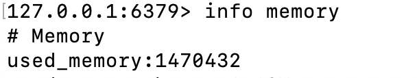
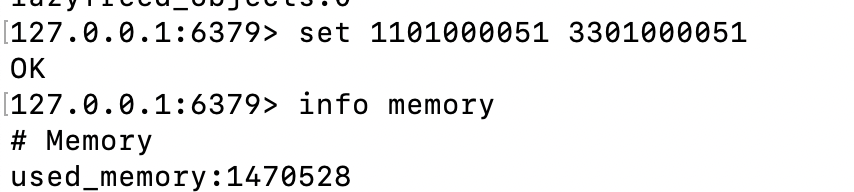
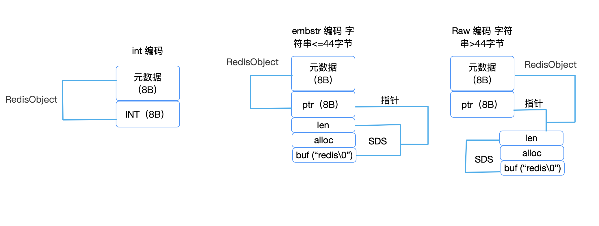
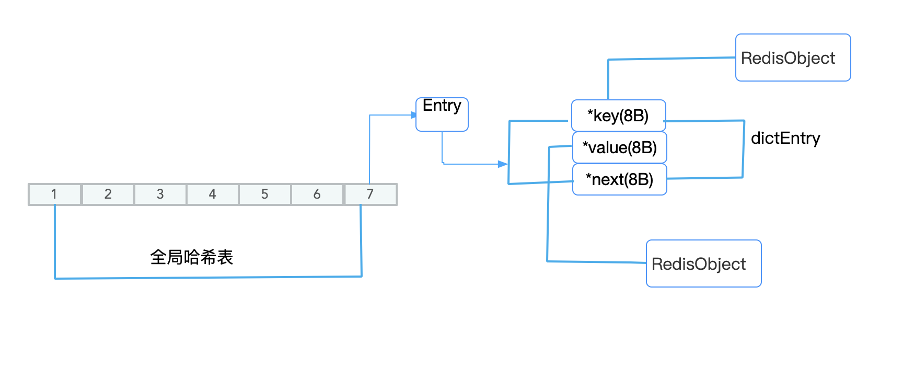
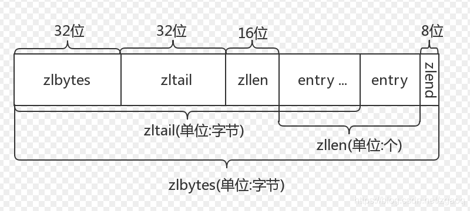

### 前言

Redis 的 string 是个 “万金油” ，这么评价它不为过. 它可以保存Long 类型整数，字符串， 甚至二进制也可以保存。对于key，value 这样的单值，查询以及插入都是O(1)时间复杂度。满脑子都是它的优点，真的就那么好吗？如果不了解它的底层结构，会有很多坑的，下面让我们细细说来。

有这样一个需求，我们要开发一个图片存储系统，要求这个系统能快速地记录图片ID和图片在存储系统中保存的ID（图片存储对象ID）。同时还更够根据图片ID快速查询图片存储对象ID。我们现在假设图片ID和图片存储对象ID都是10位数据，而且图片数量非常多。一个图片ID 和存储对象ID正好一一对应，是典型的“键 - 单值”模式。所谓的“单值”，就是指键值对中的值就是一个值，而不是一个集合，这和 String 类型提供的“一个键对应一个值的数据”的保存形式刚好契合。

|                           v1                            |                           v2                           |
| :-----------------------------------------------------: | :----------------------------------------------------: |
|  |  |

v1:存储图片ID和图片存储对象前Reids 内存

v2:存储图片ID和图片存储对象后Reids 内存

v2.used_memory-v1.used_memory=96B ，也就是说明key,value 存储用了96个字节。一组图片的ID以及存储对象ID实际上只需要16字节就可以了。

我们来分析下。图片 ID 和图片存储对象 ID 都是 10 位数，我们可以用两个 8 字节的 Long 类型表示这两个 ID。因为8字节的Long类型表示两个ID。因为8字节的Long类型最大可以表示2的64次方的数值，肯定可以表示10位数，为啥用了96个字节呢？

### String 类型低层数据结构

其实，除了记录实际的数据，String 类型还需要额外的内存空间记录数据长度、空间使用等信息，这些信息也叫元数据。当实际保存数据较小时，元数据空间很大，那就很不划算了。

大家在用Redis 的 String 类型时有没有考虑过一个问题，为啥String 那么神奇，既可以保存int，还可以保存字符串，还可以保存二进制数据。这些其实都与它低层的编码有关，不同的数可能会用不同的编码。String 编码有int、embstr 和 raw 这三种编码模式.为了详细说明，我用一张图表示：



通过图可以看出，embstr 和 Raw 编码有len，alloc, buf

1. buf：字节数组，保存实际数据。为了表示字节数组的结束，Redis 会自动在数组最后加一个“\0”，这就会额外占用 1 个字节的开销
2. len：占 4 个字节，表示 buf 的已用长度
3. alloc：也占个 4 字节，表示 buf 的实际分配长度，一般大于 len

len+alloc+buf = SDS

int编码：RedisObject = 元数据+INT，其他的编码 RedisObject = 元数据+ptr

通过图我们也可以发现embstr编码的ptr 与 SDS 是一块连续的内存区域，这样就可以避免内存碎片。当保存Long 类型数据时，RedisObject 中的指针就直接赋值为整数数据了，这样就不用额外的指针再指向整数了，节省了指针的空间开销。

上面的描述我们发现RedisObject 就是我们保存的数据，那么我们是怎么找到数据呢。不要忘了Redis 会使用一个全局的哈希表保存所有的键值对。哈希表的每一项是一个Entry 也就是我们所说的哈希桶，哈希桶每一项是一个， dictEntry 的结构体，用来指向一个键值对。dictEntry 结构中有三个 8 字节的指针，分别指向 key、value 以及下一个 dictEntry。为了详细描述这个结构，我画了一个图。



通过这些知识点我们可以分析出为什么我们会存储96个字节，key，value 会根据hash 算法，在全局哈希表表找到一个哈希桶，哈希桶每个元素就是一个Entry，那么我们的key就是放在key指针所引用的RedisObject结构体，value 就是放在value指针所引用的RedisObject 的结构体。一个key，value 所占用的空间根据图所示应该包含entry 的大小以及它们自己的RedisObject。

sum(entry) = key指针占用空间+value 指针占用空间+next指针占空空间 = 8B+8B+8B=32B，为啥是32呢。由于Redis 使用的内存分配库 jemalloc 。jemalloc 有一个特点就是分配内存一定是N 的 2 的幂次数，这样可以避免经常分配内存而影响系统的性能。所以就是32B

sum(redisobject) = sum(key的redisobject)+sum(value的redisobject) = 16B+16B = 32B

一共花费了多少内存空间？sum(key+value) = sum(entry) +sum(redisobject) = 64B，可能又有人问 96B-64B=32B去哪了，那是Entry（新申请的哈希桶）的大小是32B.这个就不能算是String消耗的内存空间。明明有效数据就是16B，有48B浪费了，如果有1亿张图片呢？1亿*48B就有那么多浪费，真的是真金白银呀，有没有更加节省的内存呢？当然有，那就是ziplist。

### 节省内存的数据结构

Redis 有一种底层数据结构，叫压缩列表（ziplist). 这个数据结构下面我们详细讲解.我找了一个图，可以展开分析下



zlbytes 表示列表长度，zltail表示列表尾，zllen 偏移量，zlend 表示列表结束

entry 是有以下结构组成 = prev_len+len+encoding+content

prev_len：表示前一个 entry 的长度。prev_len 有两种取值情况：1 字节或 5 字节。取值 1 字节时，表示上一个 entry 的长度小于 254 字节。虽然 1 字节的值能表示的数值范围是 0 到 255，但是压缩列表中 zlend 的取值默认是 255，因此，就默认用 255 表示整个压缩列表的结束，其他表示长度的地方就不能再用 255 这个值了。所以，当上一个 entry 长度小于 254 字节时，prev_len 取值为 1 字节，否则，就取值为 5 字节。

len：表示自身长度，4 字节；

encoding：表示编码方式，1 字节；

content：保存实际数据。

这些 entry 会挨个儿放置在内存中，不需要再用额外的指针进行连接，这样就可以节省指针所占用的空间。

如果我们用ziplist结构存储数据时消耗的内存是sum(entry)= sum(prev_len)+sum(len)+sum(encoding)+sum(content)=1+4+1+8=14B实际分配了16B。

这种数据结构在Redis 中有Hash、List、Sorted set 集合类型。这种方案节省内存的原因是一个key对应一个集合数据，保存数据很多也只用一个dictEntry结构这样就节省内存,key ,value 各用一个元数据。当数据多的时候，空间复杂度就被分摊了，这样就节省内存了。

怎么保存hash的结构，我们需要对原始的单值的key用二级编码方式拆分两部分，前一部分作为Hash集合的key，后一部分作为hash集合value 的key。

以图片 ID 1101000060 和图片存储对象 ID 3302000080 为例，我们可以把图片 ID 的前 7 位（1101000）作为 Hash 类型的键，把图片 ID 的最后 3 位（060）和图片存储对象 ID 分别作为 Hash 类型值中的 key 和 value。

```redis
hset 1101000 060 3302000080
```

把最后 3 位作为 Hash 类型值中的 key，也是根据配置文件中的设置，只有这样才能利用ziplist 的结构，如果超过了这个阈值，那么就只能用hash表存储数据呢，并不能有效的节省内存了。

这两个阈值分别对应以下两个配置项：

hash-max-ziplist-entries：表示用压缩列表保存时哈希集合中的最大元素个数。

hash-max-ziplist-value：表示用压缩列表保存时哈希集合中单个元素的最大长度。

hash-max-ziplist-value 这个我们一定是可以满足的，hash-max-ziplist-entries 这个值一般设置成1000,三位数最大值是999加上一个特殊值000刚好1000。这个值不建议设置很大，ziplist 除了最开始的原始和最后的原始查找的时间复杂度是O(1)，其他位置的元素时间复杂度是O(n)，值越大，获取元素越低效

除了用hash 结构，也可以用 Sorted Set，zadd 1101000 3302000080 060 可以把value 当作score 存储。显然 Sorted Set 在插入数据性能上没有hash 高效，这是因为Sorted Set插入数据时首先根据score找到对应位置，然后在插入进去，而Hash在插入元素时，只需要将新的元素插入到ziplist的尾部即可，不需要定位到指定位置


