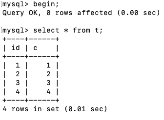
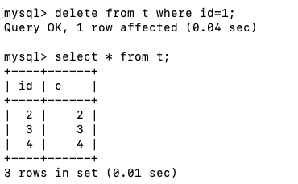
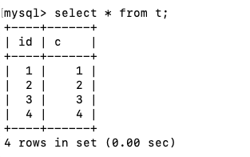

### 前言

mvcc 与一个事物的隔离级别有关，未提交读永远读的是当前值，串行化是通过加锁实现，这两种隔离级别都与mvcc 没有任何关系。现在只要一提到mvcc应该想到的是读提交以及可重复读，大家有没有想过都是mvcc，为啥这两个隔离级别所呈现的结果有些不一样呢？难道会有两套mvcc 吗？当然不是，对于这个问题，稍后我会说明的。

我先举一个简单的例子。下面是一个表的初始化语句。

```mysql
CREATE TABLE `t` (
  `id` int(11) NOT NULL,
  `k` int(11) DEFAULT NULL,
  PRIMARY KEY (`id`)
) ENGINE=InnoDB;
insert into t(id, k) values(1,1),(2,2);
```

|                       sessionA                       |                      sessionB                       |                       sessionA                       |
| :--------------------------------------------------: | :-------------------------------------------------: | :--------------------------------------------------: |
|  |  |  |

在此我说明下，sessionA 是在同一个事物下，事务的隔离级别是可重复读，sessionB 是另外一个事物。是不是感觉很神奇，sessionB 对数据操作成功了，sessionA 没有收到任何干扰。

是不是感觉sessionA 在begin 的时候像相机一样为数据表拍了一张快照。而这个快照也是我们常说的一致性读视图即 consistent read view。它的作用是事务执行期间用来定义“我能看到什么数据”。

### mvcc 是如何工作的？

在上面我们讲到了快照，大家是不是感觉我在扯淡，100G的库，你也去快照，你要拷贝100G的数据，别人不会拍死你，放心好了拍不死我的。

其实在启动一个事物的时候，并不需要拷贝数据，只需要在事物系统申请一个事物id 叫做 transaction id，这个id 是原子递增的，意味着一个数据库不会出现两个相同的事物id

每行数据也都是有多个版本的。每次事务更新数据的时候，都会生成一个新的数据版本，并且把 transaction id 赋值给这个数据版本的事务 ID，记为 row trx_id。同时，旧的数据版本要保留在undo log 里，并且在新的数据版本中，能够有信息可以直接拿到它。

可以这么说，数据表中的一行记录，其实可能有多个版本，每个版本都有自己的row trx_id。

按照可重复读的定义，一个事物启动的时候，能够看到所有已经提交的事物结果。但是之后其他事物的更新，它却看不见。

它是怎么找到自己能够看见的数据呢，会拿到每个版本的 row trx_id，如果是在我启动以后生成的row trx_id，继续往前找，直到找到自己提交的或者是本事物启动之前提交的。

为了方便比较，在实现上，innodb 为每个事物构建一个数组，用来保存这个事物启动瞬间，当前正在“活跃” 的所有事物ID。“活跃” 指的是，启动了还没有提交的。

数组里面事务 ID 的最小值记为低水位，当前系统里面已经创建过的事务 ID 的最大值加 1 记为高水位。

这个视图数组和高水位，就组成了当前事物的一致性视图。

而数据版本的可见性规则，就是基于数据的 row trx_id 和这个一致性视图的对比结果得到的。

就拿一致性视图而言，规则是这样的：

1. 如果 row trx_id 小于这个视图数组的最小值，说明已经提交了，那么这个数据就是可见的。
2. 如果 row trx_id 大于这个高水位，肯定不可见呀，说明事物还没有创建
3. 如果 row trx_id 在 最小值和高水位之间又有两种情况：row trx_id刚好就在视图数组是说明还没有提交也不可见，不在视图数组里说明提交了就可见。

所以你现在知道了，InnoDB 利用了“所有数据都有多个版本”的这个特性，实现了“秒级创建快照”的能力。

所以一个数据版本，对于一个事务视图来说，除了自己更新总是可见以外，有三种情况：

1. 版本未提交，不可见；
2. 版本已提交，但是是在视图创建后提交的，不可见；
3. 版本已提交，而且是在视图创建前提交的，可见。

下面我在在回到最开始提到的那个问题，读提交为啥又有些不一样呢，让我们在回顾一下什么是读提交，在事务中，我们可以读到已经提交的事物，只要在我事物中的任何一个时刻提交的，我都可以读到。上面的规则对于读提交同样适用，只不过读提交是在每个select语句都会去申请一个transaction id作为它的row trx_id，同时也会构建一个新的事物数组。

### 数据的更新

上面我们讲到了mvcc，其实只是在select 用到，如果是update ，或者下面的语句。

```sql
select k from t where id=1 lock in share mode;

select k from t where id=1 for update;
```

大家都知道更新数据都是先读后写的，而这个读，只能读当前的值，称为“当前读”（current read）。

或者是select 语句加上了 share mode 共享锁 或者 for update 拍他锁，这些都只能用到当前读，与mvcc 没有一点关系了。

所以这些语句执行后，会对行进行加锁，update 加行锁，share mode 加的是读锁， for update 加的是写锁。读到最新的数据

而这些锁都是两阶段锁，从加锁开始到事物结束。这么做对于数据库来说也是无赖之举，为了保证数据的一致性，是数据的同步技术。
