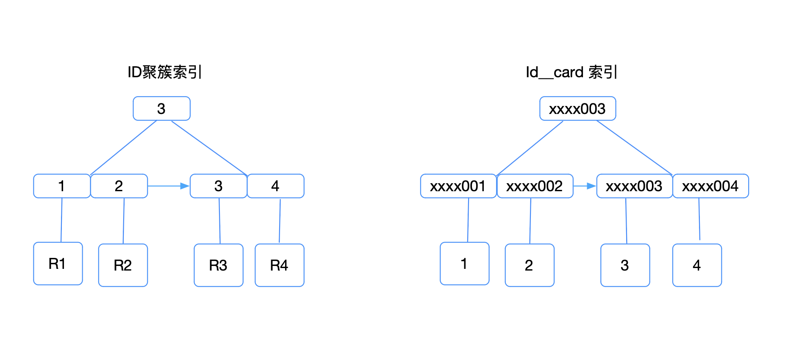

### 前言

面试的时候有时会问面试者，普通索引和唯一索引有什么区别。很多人，甚至工作很多年的工程师回答的千篇一律 “普通索引可以有重复的值，唯一索引不能有重复的值”。于是我又问，这两个索引这两个索引效率哪个高，很少有人回答的很好。下面我会从查询和更新多个维度去剖析这两个索引的区别。

现在我们系统有这样一个需求，根据用户的身份证查询用户的信息，用户表的数据很多。

```sql
select name from user where id_card='xxxx003'
```

为了查询的高效，我们肯定是要为id_card 建立索引，应该建立什么索引呢，有人说是主键索引，主键索引当然不合适，有下面几个原因：

1. id_card 不能保证顺序递增，可能会导致页的分裂，
2. 还有所占字节太大，主键索引每个叶存的数据太少，其他索引所占的空间也会增多，影响这个数据库的性能。

主键索引不合适，那么就剩下普通索引和唯一索引，对于这个需求，我们将逐步展开讨论。下面我将画出innodb 索引组织结构



接下来，我们就从这两种索引对查询语句和更新语句的性能影响来进行分析。

### 查询的区别

这个语句在B+tree 中查询过程是这样的，我们从id_card 索引树根开始查找，按层搜索到叶子节点，也就是找到了图中又下脚的那个数据叶。然后可以为数据页 内部通过二分法来定位记录。

1. 那么对于普通索引来说，查找到 (xxxx003,3) 还需要往下找，直到找到下一个 id_card !='xxxx003' 停止
2. 对于唯一索引来说，查找到  (xxxx003,3) 就停止，因为索引是唯一性的，查找到第一个满足条件的记录后，就会停止继续检索。

为此很多人感觉唯一索引在查询性能上高于普通索引，这个对性能的消耗微乎其微的。

大家都知道，在innodb 查询数据的时候，都是按数据页为单位读取的，也就是说，当我们查询一条数据，并不是这个记录本身从磁盘读出来，而是把这条数据所在页从磁盘中读出来，叶的默认大小是16kB，接下来的查询一般来说会在内存中遍历。为什么说一般来说呢，如果这条记录是页的最后一条，会经过磁盘对数据，稍微复杂点，这种概率很低，可以忽略。

### 更新的区别

Innodb 有个WAL机制，所谓的WAL机制就是先写日志，在刷盘。这样可以提高数据库的性能，否则只有每次读盘，特别是机械磁盘，一次读盘需要经过寻道，旋转，传输，性能会受到很大的影响。

对于日志来说不得不提到redo log 以及 change buffer，简单对比这两个机制在更新性能上的收益来说，redo log 主要节省的是随机写磁盘的 IO 消耗（转成顺序写），而 change buffer 主要节省的则是随机读磁盘的 IO 消耗。

change buffer 的WAL机制是怎么实现的？

当需要更新一个数据页的时候，如果数据页在内存中直接更新，没有在内存中，在不影响数据一致性的前提下，innodb 会将这个更新操作缓存到change buffer中，这样就不用从磁盘读取这个数据页了。下次查询这个数据页，在将数据页读到内存中，执行change buffer 与这个数据页有关的操作。这种方式就能保证这个数据逻辑的正确性。说明的是change buffer 不仅在内存中有，也会被写到磁盘中。

上面我们说到执行change buffer 与这个数据页有关的操作，就是我们所说的merge。以下情况也会出发merge，数据库正常关闭，后台线程会定时merge。

是不是很神奇，那么是不是只要对数据库的更新都能用到change buffer，其实不一定的。

现在举一个例子，我们要插入(5,xxxx005) 这条记录，我们要分情况讨论。

第一种情况，这个记录要更新的目标页在内存中。两种索引处理流程是这样的

1. 唯一索引，会看 xxxx004 和 下一条记录之间是否存在一条 xxxx005的记录，没有才插入，语句执行结束。
2. 普通索引，会在 xxxx004 和 下一条记录之间直接插入一条xxxx005的记录，语句执行结束。

这样看来，普通索引和唯一索引对更新语句性能影响的差别，只是一个判断，只会耗费微小的 CPU 时间。

第二种情况，这个记录要更新的目标页不在内存中

1. 唯一索引，需要将数据页读入内存中，判断到没有冲突，插入这个值，语句执行结束
2. 普通索引，只需要该记录在change buffer ，语句就执行结束了

将数据从磁盘读入内存涉及随机 IO 的访问，是数据库里面成本最高的操作之一。change buffer 因为减少了随机磁盘访问，所以对更新性能的提升是会很明显的。

唯一索引哪种情况下都无法使用change buffer，而普通索引可以通过使用change buffer通过减少磁盘的随机读而提高性能。在想想，如果数据在更新后，立马就读取。是不是每次都要触发change buffer 的merge ，不仅要随机读还要维护chage buffer。

那么普通索引和唯一索引该怎么选择了？

我们在业务开发时第一原则是保证业务的准确性，确实需要唯一索引保证数据的唯一性，我们用唯一索引。除此之外，普通索引的优点还是很多的，特别是有些业务写多，读少比如历史数据，特别是数据量很大的情况收益还是非常显著的。

change buffer 用的是 buffer pool 里的内存，因此不能无限增大。change buffer 的大小，可以通过参数 innodb_change_buffer_max_size 来动态设置。这个参数设置为 50 的时候，表示 change buffer 的大小最多只能占用 buffer pool 的 50%。

