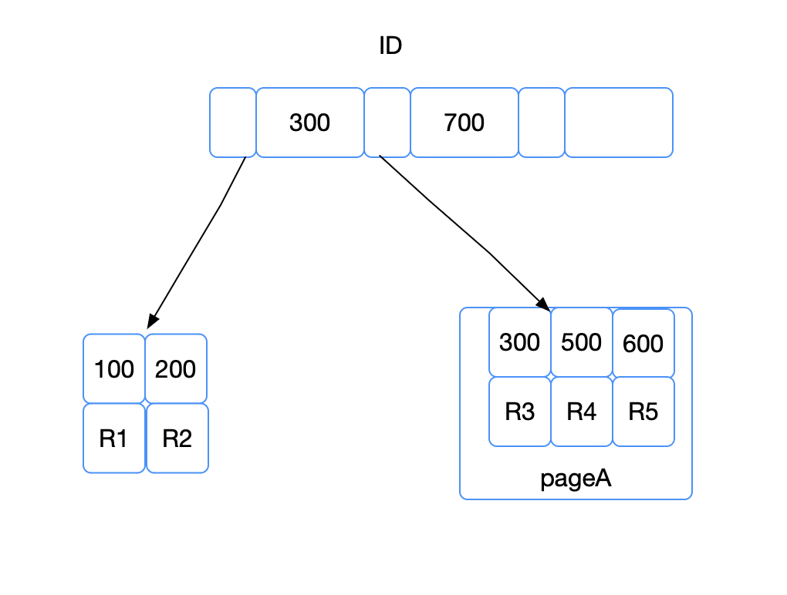
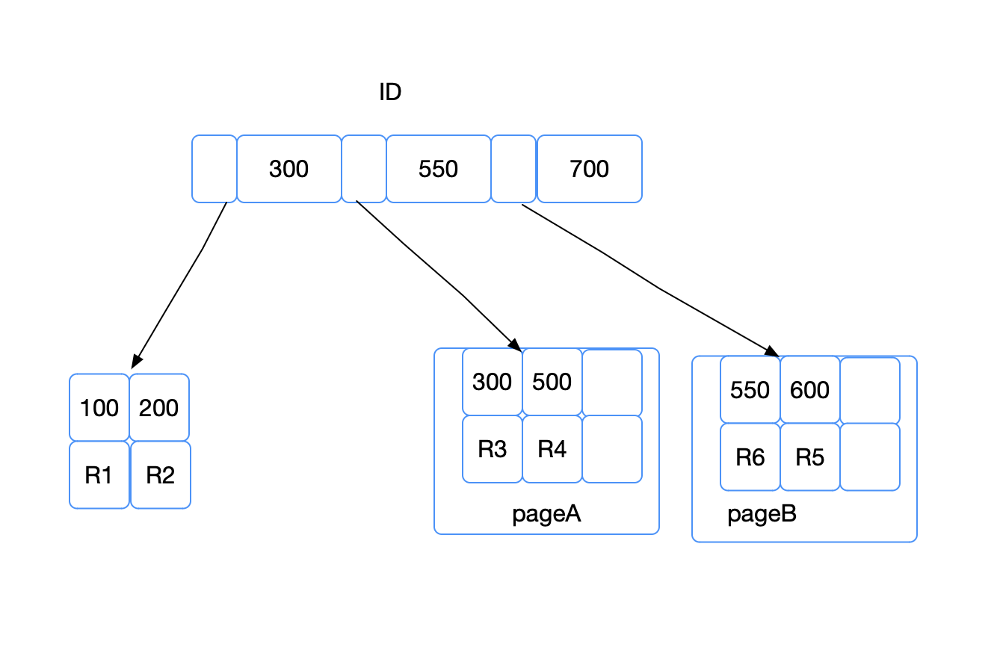

### 前言

有的时候，表的数据太多，为了提高查询以及存储，就把历史数据放到一个历史表里，在把历史数据删除，发现虽然历史数据删除，表的大小并没有发生改变。

Innodb 表有两部分，即：表结构定义和数据。在 MySQL 8.0 版本以前，表结构是存在以.frm 为后缀的文件里。而 MySQL 8.0 版本，则已经允许把表结构定义放在系统数据表中了。因为表结构定义占用的空间很小，所以我们今天主要讨论的是表数据。

### drop table 为什么无法回收表空间

在上面我们已经说过innodb 表有两部分，即：表结构定义和数据。如果表结构定义和数据在一个文件，那么drop table 就无法回收表的空间，如果表结构是存在以.frm 为后缀的文件里，那么drop table 就可以回收表的空间,直接删除就可以了。

这种行为可以通过 innodb_file_per_table 控制，在mysql 日志可以看到， innodb_file_per_table=ON 表数据存储在一个以 .ibd 为后缀的文件中,表结构存储在.frm 为后缀的文件里。innodb_file_per_table=OFF 表的数据放在系统共享表空间，也就是跟数据字典放在一起；

从 MySQL 5.6.6 版本开始，它的默认值就是 ON 了，不管任何版本都设置成ON。

Delete 删除数据内部机制

Innodb 数据都是用B+树的结构，下面图，表示的就是聚簇索引的数据结构：

​												图A

如果我们删除了R3 的数据，数据的磁盘空间并不会删除，只会在R3 标记已经删除，如果下次要出入400,直接用R3的数据空间，如果是700就用到了，索引必须保证顺序性

如果pageA 这个页被删除了，那么整个页都会被标记为已删除，下次新增数据时，需要使用新页时，不管数据大小都是可以被复用的

如果两个数据页的利用率都很小，系统就会把这两个数据页上的数据合并到其中一个页上，另一个数据页标记可复用

如果delete 删除表的所有记录，那么整个表的所有页标记都可以被复用

总之，delete 删除，之后标记成可复用，磁盘文件大小不会有任何变化。这些可以复用，而没有复用的空间，就是碎片

不仅删除可能造成碎片话，插入也可能。

​								   

图A上，我们插入ID是550，又会怎么样呢？看图B

​										图B

可以看到由于pageA 满了，在插入一个ID 是550的数据，需要申请新页pageB保存数据，也分裂后，pageA 就有碎片化了。

为啥会这样，500后面的空间为啥用不上？那是由于页分裂策略决定的：

非递增情况innodb的页分裂策略就是50%分裂，在整个页中前50%的不动，后百分之50%的移动到新的页。 50%分裂策略的优势： 分裂之后，两个页面的空间利用率是一样的；如果新的插入是随机在两个页面中挑选进行，那么下一次分裂的操作就会更晚触发； 50%分裂策略的劣势： 空间利用率不高：按照传统50%的页面分裂策略，索引页面的空间利用率在50%左右； 分裂频率较大：针对如上所示的递增插入(递减插入)，每新插入两条记录，就会导致最右的叶页面再次发生分裂；

那么更新索引上的值，可以理解为删除一个旧值然后插入一个新值，也会造成碎片。

综上可以看出，一张表经过大量的DML操作都会有碎片化，同时也可以看出delete 并不会减少磁盘大小，那么就必须重新建表

### 重建表

现在表有大量的操作，表的碎片比较多，这些占据了表的磁盘空间，影响查询性能。那么我们该怎么办呢。我们有几种方案

方案一：

1. 我们新建一张表B
2. 把原表A的数据，通过sql 插入到表B
3. 完成了，用表B替换表A

这个方案解决了表的碎片问题，但是会有业务数据的丢失，在数据插入表B时，有其他数据写入表A，这个是在server 认为操作的。

方案二：

以使用 alter table A engine=InnoDB 命令来重建表。这个命令在 MySQL 5.5 版本之前，会先加上MDL 写锁，其他的步骤和方案一是一样的，只不过表B是mysql 自己建的，此时业务是不能做DML操作的。所以说DDL不是online DDL

那么MySQL 5.5版本后有哪些变化呢？

那么在这个版本后，alter table A engine=InnoDB 成为online DDL，它是怎么做的呢？

1. 建立一个临时文件，扫描表 A 主键的所有数据页；
2. 用数据页中表 A 的记录生成 B+ 树，存储到临时文件中；
3. 生成临时文件的过程中，将所有对 A 的操作记录在一个日志文件（row log）中
4. 临时文件生成后，将日志文件中的操作应用到临时文件，得到一个逻辑数据上与表 A 相同的数据文件
5. 用临时文件替换表 A 的数据文件。

这个过程中增加一个日子文件，记录用数据页中表 A 的记录生成 B+ 树时，数据的变化，避免数据丢失。这个是在Innodb 引擎自己操作的。
需要说明的是在MySQL 5.5版本后的DDL操作也是需要加MDL锁的，不够对MDL锁进行了优化：

1. MDL写锁
2. 退化MDL读锁
3. 拷贝数据
4. MDL写锁
5. 退化MDL读锁

锁相对于业务时间非常短，所以就叫online DDL

需要补充说明的是，上述的这些重建方法都会扫描原表数据和构建临时文件。对于很大的表来说，这个操作是很消耗 IO 和 CPU 资源的。因此，如果是线上服务，你要很小心地控制操作时间。如果想要比较安全的操作的话，我推荐你使用 GitHub 开源的 gh-ost 来做。

### Online 和 inplace 比较

inplace 是原地操作，就是把数据挪动到临时表。对于方案二来说，虽然建立了临时文件，但这个临时文件是inodb 建的，server 层是没有显现的，就相当于原地，也就是一个inplace 操作，方案一就不是。

alter table t engine=InnoDB 相当于   alter table t engine=innodb,ALGORITHM=inplace;

如果这个语句写成这样 alter table t engine=innodb,ALGORITHM=copy; 表示强制拷贝表，就不是 inplace

是不是所有的alter 一定是 Online 吗？当然不一定是的

alter table t add FULLTEXT(field_name); 

这个加全文索引是要阻塞增删改操作，非Online。但是inplace

综上所述，他们的关系可以概括为

1. DDL 过程如果是 Online 的，就一定是 inplace 的；
2. 反过来未必，也就是说 inplace 的 DDL，有可能不是 Online 的。截止到 MySQL 8.0，添加全文索引（FULLTEXT index）和空间索引 (SPATIAL index) 就属于这种情况。

最后我在说明下 optimize table、analyze table 和 alter table 这三种方式重建表的区

1. 从 MySQL 5.6 版本开始，alter table t engine = InnoDB（也就是 recreate）就是方法二流程；
2. analyze table t 其实不是重建表，只是对表的索引信息做重新统计，没有修改数据，这个过程中加了 MDL 读锁；
3. optimize table t 等于 recreate+analyze。