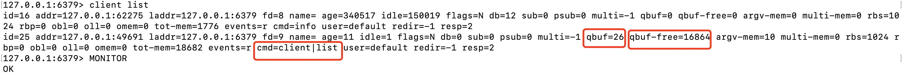

### 前言

在我的《[Redis 为啥那么快](https://blog.csdn.net/xingjigongsi/article/details/136489988?spm=1001.2014.3001.5502)》这篇文章中，详细总结了Redis 为啥那么快。今天当我要详细阐述Redis 的缓冲区时，意识到应该加上Redis 的缓冲区。我们假设没有Redis 的缓冲区，客户端向服务端发送数据，必须等待Redis 的服务端去处理，大家都知道Redis 是单线程的，虽然这么说不是很准确，为了描述，也只好这么说了。如果没有及时处理，那客户端不就阻塞了吗，有多个客户端，redis 阻塞的时间不是更长了吗？现在我们有了缓冲区，客户端就可以把命令提交到客户端缓冲区，然后去输出缓冲区接收数据的返回，服务端直接从客户端读取数据，不用客户端持续等待。是不是就有点像Redis客户端和redis 服务端解绑了一样，谁都不知道谁的存在，只需要与中间的缓冲区交互就可以了。

如果我们使用不当，缓冲区可能会溢出，就会丢失数据。不给缓冲区设置大小，随着缓冲区的增大，最终会耗尽所有的内存，Redis 也就崩溃了。

下面我将从输入缓冲区，以及输出缓冲区，对于输出缓冲区，又从单个Redis 实例 到集群阐述这个问题。

为了描述客户端输入和输出缓冲区，我先画个图：

​										图1

### 客户端输入缓冲区

根据图1可以看到一个客户端对应一个输入缓冲区和输出缓冲区。Redis 客户端把命令写到输入缓冲区，Redis 主线程从输入缓冲区读取命令，在把返回的信息写到输出缓冲区，Redis 客户端从输出缓冲区读取响应命令。

我们上面讲到过，缓冲区不可能是无限大的，它是有大小的，就可能出现溢出。

客户端缓冲区的溢出有下面几种情况

1. 写入了bigkey，比如写入的集合数据达到了百万级
2. Redis 主线程发生阻塞，这个问题，以前文章阐述过,客户端不断向输入缓冲区写入命令，此时主线程无法处理，就溢出了

可以通过下面这种方式查看输入缓冲区的使用情况：client list 

通过上图可以看到每个客户端对应一行数据，包括客户端的ip 地址，以及输入缓冲区使用了大小，输入缓冲区尚未使用的大小。

cmd，客户端最新执行的命令，qbuf 输入缓冲区已经使用的大小， qbuf-free 缓冲区尚未使用的大小。这个客户端分配的缓冲区大小 = qbuf+qbuf-free 

如果 qbuf-free  很小的话，下次的命令大于 qbuf-free 的话，此时redis 又不能及时处理输入缓冲区数据时，就会造成输入缓冲区溢出，那么Redis 就会关闭这个客户端。

1. Redis 服务器端不止一个客户端，当多个客户端连接占用的内存总量>redis 的 maxmemory 配置时，就会触发Redis 数据淘汰。
2. 如果没有设置maxmemory时，那么多客户端连接可能会耗尽服务器所有内存，服务器奔溃了。

对于第1点，可能会说调大输入缓冲区，不好意思，没有这个参数可以设置，都是redis 代码写死的，大概是1G，不同版本也可能会不一样，记住是无法调整的，既然无法调整，那就是写命令，避免写入bigkey，避免redis 主线程阻塞
第2点，就是集群，现在都是这么干的

### 输出缓冲区

输出缓冲区有两部分组成：一部分，是一个大小为 16KB 的固定缓冲空间，用来暂存 OK 响应和出错信息；另一部分，是一个可以动态增加的缓冲空间，用来暂存大小可变的响应结果。

有下面几种情况下，输出缓冲区会溢出：

1. 服务器端返回 bigkey 的大量结果，把溢出缓冲区内存打爆
2. 执行了 MONITOR 命令 就会持续输出监控命令到输出缓冲区
3. 输出缓冲区设置的太小，也就是 client-output-buffer-limit

输出缓冲区是如何设置的，可以用命令：client-output-buffer-limit，如下图

normal ，pubsub , slave 分布是下列，我分别讲解
分别是常规和 Redis 服务器端进行读写命令交互的普通客户端，(normal)
以及订阅了 Redis 频道的订阅客户端. (pubsub)
在 Redis 主从集群中，主节点上也有一类客户端（从节点客户端）用来和从节点进行数据同步 (slave)

普通客户端输出缓冲区设置
client-output-buffer-limit normal 0 0 0 
第 1 个 0 设置的是缓冲区大小限制，第 2 个 0 和第 3 个 0 分别表示缓冲区持续写入量限制和持续写入时间限制。这个一般都会这么设置
普通客户端写入命令，都会等待Redis 返回，在发送下一个命令，不是大的bigkey，输出缓冲区不会阻塞，也不会溢出。所以这么设置

订阅客户端设置缓冲区大小，为了好描述，这里用单位M
client-output-buffer-limit pubsub 8mb 2mb 60
订阅客户端和普通客户端不太一样，订阅客户端不是阻塞的，如果向频道发送大量的数据就会占用较多的输出缓冲区
8Mb 输出缓冲区大小，2mb 60 表示60秒写2MB 的数据。这两个条件只要满足一个，客户端就会关闭连接

### 集群缓冲区

主从集群间数据复制包括两种全量复制和增量复制。这两种复制都会用到缓冲区，这两个问题，我们分开讨论。

#### 全量复制缓冲区问题

全量复制指的是从节点与主节点第一次连接，主节点会把主节点的RDB 传给从节点去执行。这就是全量复制。此时主节点会继续接收客户端的写请求，而这些请求会先保存在复制缓冲区中，等RDB传输完成后，在把复制缓冲区的命令给从节点，如果有多个从节点，那就有多个复制缓冲区。用来保证所有主从节点间数据同步。

那么如果在全量复制时，从节点接收和加载 RDB 较慢，同时主节点接收到了大量的写命令，写命令在复制缓冲区中就会越积越多，最终导致溢出。

其实我们可以看到主节点的复制缓冲区就是从节点的输出缓冲区，如果这个缓冲区溢出了，那么主节点也会直接关闭和从节点进行复制操作的连接，导致全量复制失败。

如何避免了复制缓冲区溢出，我感觉有两点：

1. 控制主节点保存数据量的大小，一般会把主节点数据量控制在2-4GB，这样，RDB 文件小，主从同步快，同时也不至于复制缓冲区因为写了太多而没有及时传给从节点导致复制缓冲区溢出
2. 可以通过 client-output-buffer-limit 命令设置复制缓冲区合适的大小。主要是根据，主从节点数量大小、主节点的写负载压力和主节点本身的内存大小。
3. **还有一个问题我要提一下，复制缓冲区的内存开销是每个从节点客户端输出缓冲区占用内存的总和，这一点大家一定要记住。**

可以这么设置：

client-output-buffer-limit slave 512mb 128mb 60

复制缓冲区大小是512mb，60秒写入128M。两个条件满足其中之一表示复制缓冲区溢出，此时全量复制失败了

**所有从节点的客户端输出缓冲区之和是512mb**

#### 增量复制缓冲区问题

增量复制只会把主从库网络断连期间主库收到的命令，同步给从库。主节点把接收到的写命令同步给从库时，同时也会把这些命令写入
复制积压缓冲区。主从网络中断后，再次和主节点恢复连接后，从节点就会从复制积压缓冲区中，读取断连期间主节点接收到的写命令，进而进行增量同步。

首先我们要明白复制积压缓冲区是一个大小有限的环形缓冲区。当主节点把复制积压缓冲区写满后，会覆盖缓冲区中的旧命令数据。如果从节点还没有同步这些旧命令数据，就会造成主从节点间重新开始执行全量复制。

其次可以 repl_backlog_size 调整复制积压缓冲区的大小，这个大小怎么设置呢，根据下面的规则：

这个参数和所需的缓冲空间大小有关。缓冲空间的计算公式是：缓冲空间大小 = 主库写入命令速度 * 操作大小 - 主从库间网络传输命令速度 * 操作大小。在实际应用中，考虑到可能存在一些突发的请求压力，我们通常需要把这个缓冲空间扩大一倍，即 repl_backlog_size = 缓冲空间大小 * 2，这也就是 repl_backlog_size 的最终值。

好了，写到这里，有问题给我记得给我留言。

