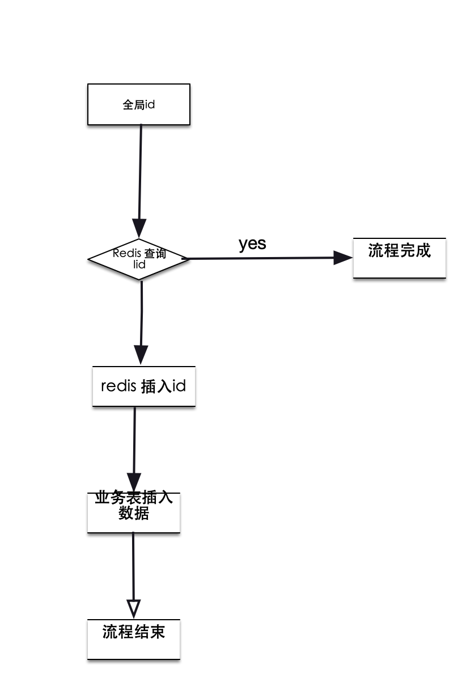

### 前言

幂等性设计，就是说，一次和多次请求某一个资源应该具有同样的副作用。为什么我们要有幂等性操作？说白了，就两点：1、网络的不稳定性  2、服务状态不确定性，服务状态不仅有成功，失败，还有超时。超时又有多种原因引起的，有可能是网络抖动，也有可能是负载引起的。对于这种情况，需要做重试，重试的后果是服务被调用了多次，数据不对，业务当然出问题了。打个比方吧，我们网上购物，去支付时，网络原因超时，我们做重试，在我们发起重试后，网络好了，是不是有可能执行了两次，扣了两次钱。这样的情况其实有很多很多，还比如，订单服务重试，创建了两个同样的订单，等等。

系统超时，而调用方重试一下，给我们的系统带来不一致的副作用。遇到这样的情况，有几种情况处理

1. 需要下游系统提供相应的查询接口。上游系统在 timeout 后去查询一下。如果查到了，就表明已经做了，成功了就不用做了，失败了就走失败流程
2. 通过幂等性的方式。也就是说，把这个查询操作交给下游系统，我上游系统只管重试，下游系统保证一次和多次的请求结果是一样的
3. 可以在一些特殊字段比如订单号设置成唯一索引，让数据表自己去判断

在这几种处理情况中，第一点主要是需要系统提供查询接口，第三点是根据数据库的特性设计。第二点比较比较特殊，我会详细讲解。

以上说的是业务的幂等性，还有HTTP 的幂等性，消息队列的幂等性主要谈论kafka 幂等性的设计。

### 幂等性设计

幂等性设计，需要有一个唯一的标识，来标志是同一个请求发起的。这个唯一的标识一般会用全局ID，才能做到全局唯一性。那么这个全局ID，怎么分配的。

1. 可以有一个中心的发号系统分配，每个请求就先请求发好系统，简单的业务可以用redis incr 。但是这样会有很多问题，中心的发号系统会成为系统的瓶颈，每次请求都要去请求发号系统。若设计成集群，那么全局ID 可能会重复，这个方案比较适合流量小，设计成单体系统。

2. 为了解决集群ID 冲突问题，们需要使用一个不会冲突的算法，比如使用 UUID 这样冲突非常小的算法。UUID 占用字符串空间大，索引效率低，生成的ID 太过于随机，索引为了保证数据的顺序性，可能会页的分裂。

3. 在全局唯一 ID 的算法中，这里介绍一个 Twitter 的开源项目 Snowflake。它是一个分布式 ID 的生成算法。它的核心思想是，产生一个 long 型的 ID，

   1）41bits 作为毫秒数。大概可以用 69.7 年。

   2）10bits 作为机器编号（5bits 是数据中心，5bits 的机器 ID），支持 1024 个实例。

   3）12bits 作为毫秒内的序列号。一毫秒可以生成 4096 个序号。

它主要是有几部分组成：41bits 为毫秒级时间+5bits data center id+5 bits worked id+12 bits 毫秒内的技术

### 幂等性设计处理流程

方案一：我们可以先通过记录全局id查询。每次请求的时候，先去查，没有的话，就记录下来，有的话，就不处理请求，这样每次都必须先查询。

对于方案一是几个步骤：1、先查询全局id     2、插入数据。感觉这个设计保证数据的一致性是很难的。

1、我们把全局ID放在redis中流程图是这样的

这个妥妥的是有问题的，并发请求，查询Redis，没有，都会同时插入数据，舍弃

2、如果直接在数据表，先查询呢，可能有多个请求同时查询，没有，同时插入，也是有问题的。

这种方案需要加入分布式锁，客户端与客户端之间互斥只有一个客户端能够操作，加入了分布式锁无疑增加了系统的复杂度，而且效率也会低的。

方案二、其实我们可以直接用sql 语句操作。对于insert   insert into … values … on DUPLICATE KEY UPDATE …

方案三 对于更新来说，如果只是状态更新，多次操作不会有副作用，是幂等的，比如 update table set status = “paid” where id = xxx and status = “unpaid”;    当然还有mvcc 乐观锁去处理，都是可以的，还是建议大家用全局id

### HTTP 幂等性

http 有几个方法：GET、HEAD、OPTIONS、DELETE、POST、PUT ，http 幂等性与这几个方法有关：

GET 方法用于获取资源，没有副作用，是幂等的。比如 http://www.bank.com/account/123456 ，不会改变资源的状态，调用n次返回的都不会改变资源，没有副作用。因此是幂等的

HTTP HEAD 和 GET 本质是一样的，区别在于 HEAD 不含有呈现数据，而仅仅是 HTTP 头信息，不应有副作用，也是幂等的。有的人可能觉得这个方法没什么用，其实不是这样的。想象一个业务情景：欲判断某个资源是否存在，我们通常使用 GET，但这里用 HEAD 则意义更加明确。也就是说，HEAD 方法可以用来做探活使用。

HTTP OPTIONS 主要用于获取当前 URL 所支持的方法，所以也是幂等的。若请求成功，则它会在 HTTP 头中包含一个名为“Allow”的头，值是所支持的方法，如“GET, POST”。

HTTP DELETE 方法用于删除资源，有副作用，但它应该满足幂等性。比如：DELETE http://www.forum.com/article/4231，调用一次和 N 次对系统产生的副作用是相同的，即删掉 ID 为 4231 的帖子。因此，调用者可以多次调用或刷新页面而不必担心引起错误。

HTTP POST 方法用于创建资源，所对应的 URI 并非创建的资源本身，而是去执行创建动作的操作者，有副作用，不满足幂等性。比如：POST http://www.forum.com/articles的语义是在http://www.forum.com/articles下创建一篇帖子，HTTP 响应中应包含帖子的创建状态以及帖子的 URI。两次相同的 POST 请求会在服务器端创建两份资源，它们具有不同的 URI；所以，POST 方法不具备幂等性。

HTTP PUT 方法用于创建或更新操作，所对应的 URI 是要创建或更新的资源本身，有副作用，它应该满足幂等性。比如：PUT http://www.forum/articles/4231的语义是创建或更新 ID 为 4231 的帖子。对同一 URI 进行多次 PUT 的副作用和一次 PUT 是相同的；因此，PUT 方法具有幂等性。

所以，对于 POST 的方式，很可能会出现多次提交的问题，就好比，我们在论坛中发帖时，有时候因为网络有问题，可能会对同一篇贴子出现多次提交的情况。对此，一般的幂等性的设计如下。

1. 首先，在表单中需要隐藏一个 token，这个 token 可以是前端生成的一个唯一的 ID。用于防止用户多次点击了表单提交按钮，而导致后端收到了多次请求，却不能分辨是否是重复的提交。这个 token 是表单的唯一标识。（这种情况其实是通过前端生成 ID 把 POST 变成了 PUT。）
2. 然后，当用户点击提交后，后端会把用户提交的数据和这个 token 保存在数据库中。如果有重复提交，那么数据库中的 token 会做排它限制，从而做到幂等性。
3. 当然，更为稳妥的做法是，后端成功后向前端返回 302 跳转，把用户的前端页跳转到 GET 请求，把刚刚 POST 的数据给展示出来。如果是 Web 上的最好还把之前的表单设置成过期，这样用户不能通过浏览器后退按钮来重新提交。这个模式又叫做 PRG 模式（Post/Redirect/Get）。

### 消息队列幂等性 机遇kafka

生产端：从kafka 0.11.0 版本开始 每个生产端生成一个唯一的ID，在每条消息中生成一个sequence num 进行消息去重，只对在一个生产端内生产的消息有效。也可以在消息内容加个全局id 业务判断，和上面一样的。

