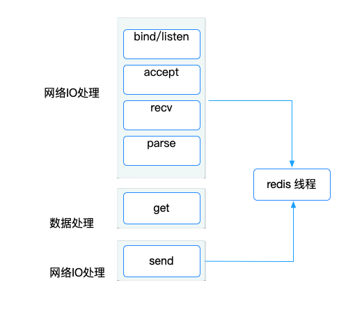
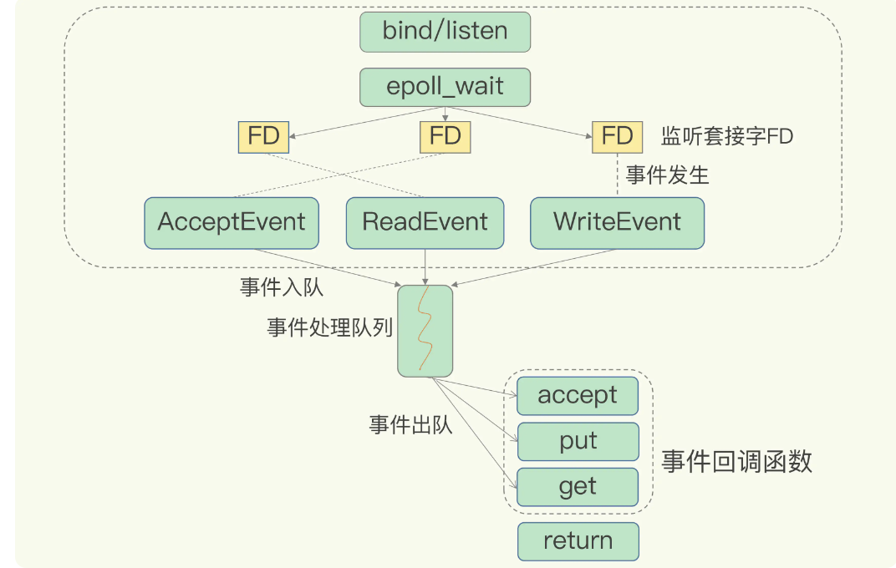

### 前言

我们一直说redis 是单线程的，主要是指 Redis 的网络 IO 和键值对读写是由一个线程来完成的，这也是 Redis 对外提供键值存储服务的主要流程。其他的功能，比如持久化、异步删除、集群数据同步，是由子线程完成的。所以说redis 是单线程，是主路径上的操作是单线程，并不代表只有一个线程。这一点大家要注意，接下来，我会详细给大家讲解redis 为啥是单线程以及它为啥那么快。

### 为什么用单线程

提起单线程，并不是说多线程不好。利用多线程编程，可以充分利用计算机资源（cpu）增加系统的吞吐率，系统运行的更快，提高效率，节省时间。可以多线程在现在计算机编程中，特别是云计算，人工智能上有着非常重要的作用。特别是有些语言比如go，因为支持多线程编程，受到大家青睐。那么多线程有没有缺点呢？当然是有的，有些操作会变的很慢而且复杂，比如说i++,在单线程可以看作是原子性的，意味着结果在任何情况下都是唯一的。而在多线程下，必须加锁，才能保证数据的准确性。

拿redis 来说，很多数据类型，比如list，set，zset，incr  等操作，如果是多线程必须进行加锁，不加锁数据可能就被覆盖或者顺序不对，影响整个业务。如果加锁了，操作变成串行了，系统吞吐率并没有随着线程的增加而增加。而redis 的瓶颈往往是网络io，所以多线程对redis 没有好处，还增加了编程的复杂度，下面我们讲讲单线程redis 为什么那么快。

### redis 为什么那么快

redis 虽然是单线程的，每秒钟能够达到十万级别的处理能力。这是redis 多方面设计的结果，一方面 redis 大部分操作都是在内存上完成，并且它采用很多高效的数据结构，例如哈希表和跳表。另一方面，就是redis 采用了多路复用机制，使其在网络 IO 操作中能并发处理大量的客户端请求，实现高吞吐率。第一方面都好理解，现在我们主要讲解多路复用机制。

如果redis 采用的是下面的IO模型会怎么样：

bind/listen 需要监听客户端请求，accept  客户端建立连接，recv 从socket 读取请求，parse 解析客户端请求，get 获取数据，sned 把数据发送给客户端

这个模型有几个潜在的阻塞点，分别是 accept() 和 recv()。当 Redis 监听到一个客户端有连接请求，但一直未能成功建立起连接时，会阻塞在 accept() 函数这里，导致其他客户端无法和 Redis 建立连接。类似的，当 Redis 通过 recv() 从一个客户端读取数据时，如果数据一直没有到达，Redis 也会一直阻塞在 recv()

这就是阻塞模式，无法处理其他客户端请求，当然不可以，有阻塞模式当然有非阻塞模型

在非阻塞模型下，有这么几个方法：

socket() : 返回主动套接字				 				

listen()： 返回监听套接字	可以设置非阻塞	accept() 非阻塞			

accept()： 返回已经连接套接字  可以设置非阻塞     send()/recv() 非阻塞

针对监听套接字，我们可以设置非阻塞模式：当 Redis 调用 accept() 但一直未有连接请求到达时，Redis 线程可以返回处理其他操作，而不用一直等待。但是，你要注意的是，调用 accept() 时，已经存在监听套接字了。

虽然 Redis 线程可以不用继续等待，但是总得有机制继续在监听套接字上等待后续连接请求，并在有请求时通知 Redis。

类似的，我们也可以针对已连接套接字设置非阻塞模式：Redis 调用 recv() 后，如果已连接套接字上一直没有数据到达，Redis 线程同样可以返回处理其他操作。我们也需要有机制继续监听该已连接套接字，并在有数据达到时通知 Redis。

这样才能保证 Redis 线程，既不会像基本 IO 模型中一直在阻塞点等待，也不会导致 Redis 无法处理实际到达的连接请求或数据。

虽然异步io 模型在性能上有了很大的提高，但是性能还是满足不了要求。redis 用的是epoll 机制。下面我们介绍下，这种机制。

下面是redis 的io 模型

我会根据这个图详细讲解，bind/listen 监听端口，当有客户端请求的时候，epoll_create 会去创建一个epoll 实例，然后

通过 epoll_ctl 向 epoll 实例注册FD（监听套接字）对应的事件（ReadEVENT,WriteEVent）并把 EPOLLET：设置为 edge-triggered，边缘触发，此时FD从用户空间到内核空间，内核监控。

epoll_wait 可以获取要处理的事件

int epoll_wait(int epfd, struct epoll_event *events, int maxevents, int timeout);  返回值: 成功返回的是一个大于0的数，表示事件的个数；返回0表示的是超时时间到；若出错返回-1.

events 就是事件列表。循环时间列表取出加入到事件处理队列中，redis 从队列取出事件，并调用相关函数去执行。

着就是redis 多路复用的过程。

不足之处，希望大家补充。

