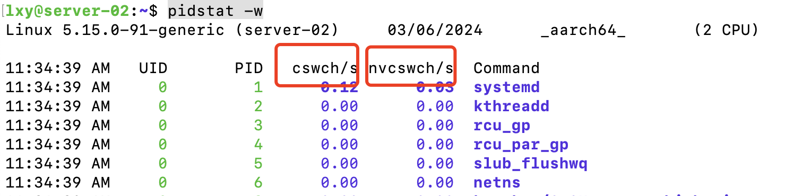

### 前言

说到redis 性能优化，优化的目的是什么？提高响应，减少延迟。就要关注两点，一是尾延迟，二是Redis 的基线性能。只有指标，我们的优化，才有意义，才能做监控以及报警。这些指标需要借助一定工具进行压力测试，高于这个值就说明需要优化了，这些值，不是绝对的，不同的服务器配置，都会有一些变化，下面我将介绍这两点。

### 尾延迟

不同公司，不同业务有不同的要求。比如有些公司要求redis 的请求 99% 的 GET 请求要小于400微妙，PUT 请求要小于500微妙。99% 是什么呢？比如说，我们有1000个请求，假设按请求延迟从小到大排序后，第 991 个请求的延迟实测值是 1ms，而前 990 个请求的延迟都小于 1ms，所以，这里 99% 尾延迟就是 1ms。这就是尾延迟，我们必须要把前991个请求的延迟时间在我们的要求范围内。

对于这个问题，我们该怎么优化呢？可以从下面这几个方面考虑

1. 降低操作命令的复杂度  
2. 同时关闭RDB 和 AOF 
3. 一个 Redis 实例对应绑一个物理核

第1点有点难，操作命令复杂度其实与业务有关，但是也可以考虑用复杂度低的操作，这个看业务

第2点根据业务和架构，如果redis 不是主从也不是集群以及这些数据不需要实例话，那么可以关闭RDB和AOF的

第3点我只想稍微解释下，需要大家对cpu 的结构有一定的理解，我从网上找了一个cpu架构图。


上图中第一个L3 cache 代表第一个cpu，第二哥 L3 cache 代表第二个cpu。每个cpu 都有两个物理核。

上面是多cpu 架构，在多cpu架构上，应用程序可以在不同的处理器上运行。也就是说Redis 可以现在第一个cpu 上运行一段时间，然后在被调度到第二个cpu 运行。Redis 现在第一个cpu 上运行，并且把数据保持到了L1,L2 ,L3 cache。然后又被调度到第二个cpu上运行，此时在访问数据就会去第一个cpu 的 L1,L2 ,L3 cache上的数据，这种属于远程远端内存访问。

在一个 CPU 核上运行时，应用程序需要记录自身使用的软硬件资源信息（例如栈指针、CPU 核的寄存器值等），我们把这些信息称为运行时信息。同时，应用程序访问最频繁的指令和数据还会被缓存到 L1、L2 缓存上，以便提升执行速度。

但是，在多核 CPU 的场景下，一旦应用程序需要在一个新的 CPU 核上运行，那么，运行时信息就需要重新加载到新的 CPU 核上。而且，新的 CPU 核的 L1、L2 缓存也需要重新加载数据和指令，这会导致程序的运行时间增加。

这个优化点不是一股脑的就去优化，我们仔细检测 Redis 实例运行时的服务器 CPU 的状态指标值，如果redis CPU 的 context switch 次数比较多,就需要优化。

context switch 是指线程的上下文切换，这里的上下文就是线程的运行时信息。在 CPU 多核的环境中，一个线程先在一个 CPU 核上运行，之后又切换到另一个 CPU 核上运行，这时就会发生 context switch。

当 context switch 发生后，Redis 主线程的运行时信息需要被重新加载到另一个 CPU 核上，而且，此时，另一个 CPU 核上的 L1、L2 缓存中，并没有 Redis 实例之前运行时频繁访问的指令和数据，所以，这些指令和数据都需要重新从 L3 缓存，甚至是内存中加载。这个重新加载的过程是需要花费一定时间的。而且，Redis 实例需要等待这个重新加载的过程完成后，才能开始处理请求，所以，这也会导致一些请求的处理时间增加。

在linux 系统下可以用下面命令查看程序的context switch:



 cswch 表示自愿的上下文切换，进程运行时由于系统资源不足，如IO,内存等原因不得不进行切换。 

nvcswch 表示非自愿的上下文切换，比如时间片用完，系统调度让其他任务运行，或者竞争CPU的时候也会发生。

cswch/s 表示每秒上下文切换次数。

那么怎的绑定呢，可以用 taskset 命令，命令如下：

```shell
taskset -c 0 ./redis-server
```

就把 Redis 实例绑在了 0 号核上，其中，“-c”选项用于设置要绑定的核编号。

我们在《[redis 为什么会阻塞](https://blog.csdn.net/xingjigongsi/article/details/136417436)》讲过，redis 不仅有对redis 主线程关键路径上的操作，还有子线程aof 重写，生成rdb 操作。主线程和子线程都会资源竞争,在aof 重写等情况下，主线程会被阻塞，为了缓解这么状况，应该把cpu物理核的所有核都绑定上。

我们用lscpu 查看cpu 所有的逻辑核：

```shell
lscpu

Architecture: x86_64
...
NUMA node0 CPU(s): 0-5,12-17
NUMA node1 CPU(s): 6-11,18-23
...
```

上面表示的一个服务器，有两个cpu 分别是node0,node1 。 每个cpu 是6个物理核，每个物理核又有两个逻辑核，总共24个逻辑核。它的编号规则是，先编号每个物理核的第一个逻辑核，在编号第二个物理核的所有逻辑核

对于node0 来说 0-5 的意思是：

0  第一个物理核的第一个逻辑核 ，1 第二个物理核的第一个逻辑核，2 第三个物理核的第一个逻辑核，3 第四个物理核的第一个逻辑核，4 第五个物理核的第一个逻辑核，5 第六个物理核的第一个逻辑核

对于node0 来说 12-17 的意思是：

12   第一个物理核的第二个逻辑核，13 第二个物理核的第二个逻辑核，14 第三个物理核的第二个逻辑核，15 第四个物理核的第二个逻辑核，16 第五个物理核的第二个逻辑核，17 第六个物理核的第二个逻辑核

那么如我我们要绑定cpu 的第一个物理核上，综上所述可以这么写：

```bash
taskset -c 0,12 ./redis-server
```

还可以进一步优化，把子进程和后台线程绑到不同的 CPU 核上。对于Redis 6.0 以上的版本可以通过配置 (redis.conf) ：

```bash
io-threads-affinity 1,13   //绑定到第一个cpu第二个物理核上
```

对于 Redis 6.0 以下可以修改源码，现在大家用的都是高版本，对于修改源码不讲解了，大家用的也不会太多，而且必须对源码有很深的理解。

篇幅比较长下基线性能测试放到下一篇了。
