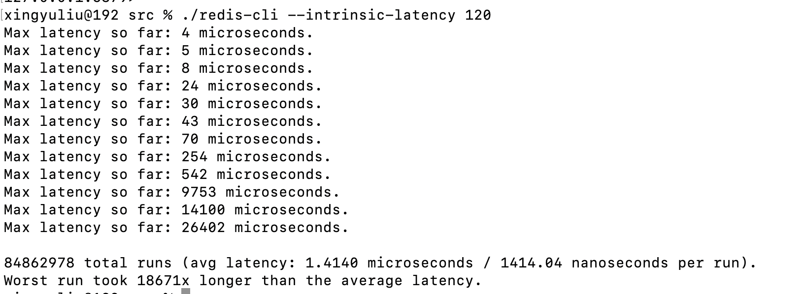

### 前言

性能优化的第二篇文章，将重点讲一下Redis 的响应延迟，响应延迟如何对redis 进行优化。这个延迟不是说一个命令或者几个命令变慢了，延迟了几秒，就说Redis 变慢了。在不同的软硬件环境下，Redis 本身的绝对性能并不相同。要根据Redis 的基线性能做判断。所谓的基线性能呢，也就是一个系统在低压力、无干扰下的基本性能，这个性能只由当前的软硬件配置决定。

怎么确定基线性能呢？可以用下面这个方法：

实际上，从 2.8.7 版本开始，redis-cli 命令提供了–intrinsic-latency 选项，可以用来监测和统计测试期间内的最大延迟，这个延迟可以作为 Redis 的基线性能。其中，测试时长可以用–intrinsic-latency 选项的参数来指定。

我们运行上面的命令，该命令可以打印出120秒内监测到的最大延迟。根据图可以看到，最大延迟是 26402 microseconds（微秒），那么我们的基线性能为 26402 microseconds（微秒）。需要注意的是基线性能和当前操作系统与硬件配置有关，所以我们可以把它和Redis运行时的延迟结合起来，进一步判断，Redis 性能是否变慢了。

这个数据有点大，是在我本地机器上测试的，所以对于我的机器来说，只要命令不是高于基准测试的2倍，就可以认为是正常的，如果高于两倍的话就是变慢了。

对于redis 在虚拟化环境来说，在虚拟化环境（例如虚拟机或容器）中，由于增加了虚拟化软件层，与物理机相比，虚拟机或容器本身就会引入一定的性能开销，所以基线性能会高一些。

以上就是我们判断redis 是是否变慢了

这种方法只是考虑到了软硬件对Redis 的影响，只是在本地测试的。如果想进一步了解网络对Redis 的影响，可以用 iPerf 工具

### Redis 变慢如何解决

我们先从redis 本身考虑，关注慢查询命令，所谓慢查询命令就是操作复杂度很高的命令。可以看一看官网，对每个命令复杂度都有介绍

比如 当Redis 操作的是 String时，主要操作的是hash 表，复杂度是O(1)，如果操作类型为Set 时，SORT、SUNION/SMEMBERS 复杂度时 O(N+M*log(M)) 和 O(N)。其中，N 为 Set 中的元素个数，M 为 SORT 操作返回的元素个数。特别要注意set、Zset 的获取元素，交集以及并集操作。

发现Redis 性能很慢的话，可以通过Redis 日志，或者通过 latency monitor 查看慢查询的请求:

启动 Redis 延迟监控

可以在redis.conf 找到 latency-monitor-threshold 找到设置一个合适的值，这个值应该与你的基线性能的2倍，这个单位时毫秒

也可以在客户端设置

CONFIG SET latency-monitor-threshold 100

然后就可以监控，并且可以不同事件进行打印，相关的可以参考[redis 官方文档](https://redis.io/docs/management/optimization/latency-monitor/)。

还可以启动慢查询日志：  CONFIG SET slowlog-log-slower-than 100  超过100微秒的就是慢查询，这个值可以根据测试的自己设置。

SLOWLOG GET 获取相关慢查询。

如果发现大量慢查询，解决方案如下：

1. 有大量的慢查询，用高效的命令。如果要返回所有集合所有的元素，可以用San，避免返回大量数据
2. 当有排序、交、并集操作，可以在客户端完成
3. 一定不要用keys，因为需要遍历存储的键值对，所以操作延时高。

过期key的操作：

我们来看过期 key 的自动删除机制。它是 Redis 用来回收内存空间的常用机制，应用广泛，本身就会引起 Redis 操作阻塞，导致性能变慢，所以，你必须要知道该机制对性能的影响。

Redis 键值对的 key 可以设置过期时间。默认情况下，Redis 每 100 毫秒会删除一些过期 key，具体的算法如下：

1. 采样 ACTIVE_EXPIRE_CYCLE_LOOKUPS_PER_LOOP 个数的 key，并将其中过期的 key 全部删除；
2. 如果超过 25% 的 key 过期了，则重复删除的过程，直到过期 key 的比例降至 25% 以下。

ACTIVE_EXPIRE_CYCLE_LOOKUPS_PER_LOOP默认值是20个key，代码里写的，默认时间是100毫秒清除，一秒钟就清除200个，对redis 影响不大

如果触发了第二个条件，就会一直删除并释放空间，删除操作是阻塞的。redis 4.0 以后可以用异步线程删除来减少阻塞线程的影响，以前版本就会阻塞在主线程上了，这个问题解决就是 EXPIREAT 以及 EXPIREAT 的过期时间参数设置，不能让他们同时过期，应该加上一个随机值

### scan的理解

关于redis 游标 （scan），在网上找了一段介绍的比较清楚的，希望对大家有帮助：

如果想要获取整个实例的所有key，建议使用SCAN命令代替。客户端通过执行SCAN $cursor COUNT $count可以得到一批key以及下一个游标$cursor，然后把这个$cursor当作SCAN的参数，再次执行，以此往复，直到返回的$cursor为0时，就把整个实例中的所有key遍历出来了。 

关于SCAN讨论最多的问题就是，Redis在做Rehash时，会不会漏key或返回重复的key。 在使用SCAN命令时，不会漏key，但可能会得到重复的key，

这主要和Redis的Rehash机制有关。Redis的所有key存在一个全局的哈希表中，如果存入的key慢慢变多，在达到一定阈值后，为了避免哈希冲突导致查询效率降低，这个哈希表会进行扩容。与之对应的，key数量逐渐变少时，这个哈希表会缩容以节省空间。 1、为什么不会漏key？Redis在SCAN遍历全局哈希表时，采用*高位进位法*的方式遍历哈希桶（可网上查询图例，一看就明白），当哈希表扩容后，通过这种算法遍历，旧哈希表中的数据映射到新哈希表，依旧会保留原来的先后顺序，这样就可以保证遍历时不会遗漏也不会重复。 2、为什么SCAN会得到重复的key？这个情况主要发生在哈希表缩容。已经遍历过的哈希桶在缩容时，会映射到新哈希表没有遍历到的位置，所以继续遍历就会对同一个key返回多次。

 SCAN是遍历整个实例的所有key，另外Redis针对Hash/Set/Sorted Set也提供了HSCAN/SSCAN/ZSCAN命令，用于遍历一个key中的所有元素，建议在获取一个bigkey的所有数据时使用，避免发生阻塞风险。

 但是使用HSCAN/SSCAN/ZSCAN命令，返回的元素数量与执行SCAN逻辑可能不同。执行SCAN $cursor COUNT $count时一次最多返回count个数的key，数量不会超过count。 但Hash/Set/Sorted Set元素数量比较少时，底层会采用ziplist方式存储，如果以这种方式存储，在执行HSCAN/SSCAN/ZSCAN命令时，会无视count参数，直接把所有元素一次性返回，也就是说，得到的元素数量是会大于count参数的。当底层转为哈希表或跳表存储时，才会真正使用发count参数，最多返回count个元素。
