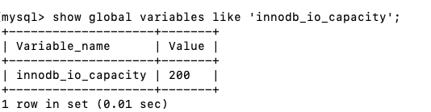
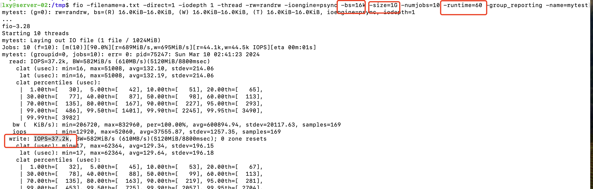

### 前言

大家是不是感觉mysql 更新挺快的呀，有没有想过mysql 更新为什么那么快。按道理说，mysql 更新都是先找到这一行数据，然后在去更新。意味着，就有两次磁盘操作，一个是磁盘读，一个是磁盘写。如果真的是这样的话，肯定会很慢呀，mysql 也没有那么傻。

当有一条记录需要更新的时候，InnoDB 引擎就会先把记录写到 redo log 里面，并更新内存，这个时候更新就算完成了。同时，InnoDB 引擎会在适当的时候，将这个操作记录更新到磁盘里面 。这个过程就是flush，flush 就是把内存里的数据写入到磁盘的过程。

当内存数据页跟磁盘数据页内容不一致的时候，我们称这个内存页为“脏页”。内存数据写入到磁盘后，内存和磁盘上的数据页的内容就一致了，称为“干净页”。也可以这么说，内存的数据一定是最新的。那什么时候数据会flush呢。

### 数据库的flush

1. redo log 已经写满了，每个更新操作，都会在 redo log 记录，这样当mysql 崩溃后，可以用redo log 恢复，这种能力就是crash-safe

2. 就是系统内存不足。当需要新的内存页，而内存不够用的时候，就要淘汰一些数据页，空出内存给别的数据页使用。如果淘汰的是“脏页”，就要先将脏页写到磁盘，这样就保证了数据页有两种状态。

   1）内存里存在，内存里肯定是正确的结果，直接返回

   2）另一种是内存里没有数据，就可以肯定数据文件上是正确的结果，读入内存后返回。这样的效率最高。

3. mysql 业务操作不是很繁忙的时候

4. mysql 正常关闭的时候

关于性能方面，4、3 两点都不会对mysql 性能没有什么影响。下面要着重讲解下1、2两点。
1点是redo log写满了，要flush 脏页，这种情况是要避免的，此时，整个系统就不在更新操作了，必须先刷脏页，只有redo log有空间了，才会继续更新。
第2点是内存不够用了，要先将脏页写到磁盘，这种情况是常态。InnoDB 用缓冲池（buffer pool）管理内存，缓冲池中的内存页有三种状态：1）还没有使用 2）使用了并且是干净页 3）使用了并且是脏页

为了提高系统的性能，Innodb 尽量会使用内存，因此对于一个长时间运行的库来说，未被使用的页面很少。当读入的数据页没有在内存的时候，必须到 buffer pool 申请一个数据页。如果没有数据页了，只能淘汰那些最久没有使用的数据页，淘汰的数据页如果是干净页，直接释放，如果是脏页，就必须把它刷到磁盘，变成干净也才能使用。那mysql 怎么知道是脏页呀，这个就是buffer pool脏页列表，最开始更新的就放在脏页列表，刷盘后，就从脏页列表移除。

刷脏页虽然是mysql 最终必须要做的事情，有些可能会影响mysql 性能

1. 一个查询淘汰的脏页个数太多，这些脏页必须先merge 操作，会把脏页写到磁盘，会影响性能
2. redo log 写满后，更新全部堵塞，必须先刷脏页，这种情况对更新频繁的业务来说不能接受的

针对这些情况，innodb 用了一些机制，避免这些情况的发生。

### nnoDB 如何控制刷脏页的

根据上面所述，innodb 刷脏页的能力非常重要，能力弱，刷脏页就少，等业务繁忙，很快redo log 写满了，业务更新停摆了。整个能力其实就是配置的，可以看下图：



你要正确地告诉 InnoDB 所在主机的 IO 能力，这样 InnoDB 才能知道需要全力刷脏页的时候，可以刷多快。
这就要用到 innodb_io_capacity 这个参数了，它会告诉 InnoDB 你的磁盘能力。这个值我建议你设置成磁盘的 IOPS。磁盘的 IOPS 可以通过 fio 这个工具来测试，下面的语句是我用来测试磁盘随机读写的命令：

```shell
 fio -filename=$filename -direct=1 -iodepth 1 -thread -rw=randrw -ioengine=psync -bs=16k -size=500M -numjobs=10 -runtime=10 -group_reporting -name=mytest 
```

我在测试环境是这样的：



bs=16k 一次读取页的大小，size=1G 写1G的数据，runtime 运行了60s，最终测试得 write IOPS = 37.2k = 37200。此时

innodb_io_capacity = 37200 ，这个就是刷盘能力，要考虑服务的负载，可以稍微低于这个值。

现在我们已经合理设置了刷脏页的能力，那么它的刷脏页的速度是怎么计算的呢？

InnoDB 的刷盘速度就是要参考这两个因素：一个是脏页比例，一个是 redo log 写盘速度。

那么速度具体是怎么计算的：

```shell
show global variables like 'innodb_max_dirty_pages_pct';
```

1. 参数 innodb_max_dirty_pages_pct 是脏页比例上限，默认值是 90%。InnoDB 会根据当前的脏页比例（假设为 M），算出一个范围在 0 到 100 之间的数字，是F1(M)
2. nnoDB 每次写入的日志都有一个序号，当前写入的序号跟 checkpoint 对应的序号之间的差值，我们假设为 N。InnoDB 会根据这个 N 算出一个范围在 0 到 100 之间的数字，这个计算公式可以记为 F2(N)。
3. Max(F1(M),F2(N)) = R,
4. innodb_io_capacity*R% = 刷盘数度

上面 F1(M)和F2(N)大家知道有这么回事就行，不必深究，想知道具体算法，只能看源码呢？只要设置合适的 innodb_io_capacity 就可以了。

平时我们要监控脏页的比率，不让接近 innodb_max_dirty_pages_pct 这个值，接近了就要报警，说明开始刷脏页，就会影响更新的性能。

```sql
select VARIABLE_VALUE into @a from global_status where VARIABLE_NAME = 'Innodb_buffer_pool_pages_dirty';
select VARIABLE_VALUE into @b from global_status where VARIABLE_NAME = 'Innodb_buffer_pool_pages_total';
select @a/@b;
```

还有一个参数也需要关注：

```sql
show global variables like 'innodb_flush_neighbors';
```

值为1它旁边的脏页也会被刷到磁盘，会一直刷到不是脏页为止，是个连锁的反应。1 只会刷本来的脏页。

机械硬盘时代是很有意义的，可以减少很多随机 IO。机械硬盘的随机 IOPS 一般只有几百，相同的逻辑操作减少随机 IO 就意味着系统性能的大幅度提升。

使用的是 SSD 这类 IOPS 比较高的设备的话，我就建议你把 innodb_flush_neighbors 的值设置成 0。因为这时候 IOPS 往往不是瓶颈，而“只刷自己”，就能更快地执行完必要的刷脏页操作，减少 SQL 语句响应时间。

好了写到这里了