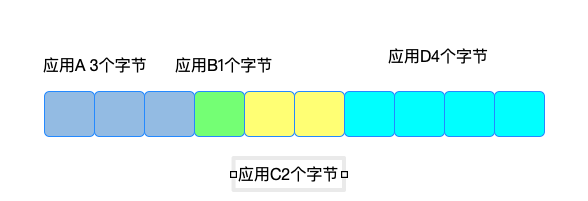
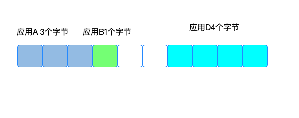
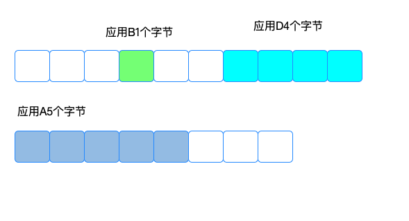
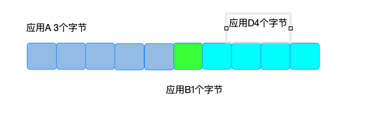

### 前言

我想讲一下怎么提高Redis 内存的利用率，redis 的数据是保存在内存中。对内存的利用率低，意味着存的数据很少，并不意味着就没有内存了，而是这些内存没法利用了，后果就是会自动删除一些key，删除key 大量的内存释放，同时会把释放的内存放到一个空的链表里，如果操作系统开始了swap，会把数据保存在磁盘。这些都会影响redis 性能。

上面讲了内存利用率低会造成什么连锁的反应，内存利用率低就是内存碎片，接下来，我将详细讲述什么是内存碎片，对于Redis 我们该怎么解决内存利用率低的问题。

### Redis 的内存碎片问题

Redis 可以使用 libc、jemalloc、tcmalloc 多种内存分配器来分配内存，默认使用 jemalloc。我就讲讲 jemalloc 分配器的分配策略，是按照2的n次方大小分配内存空间的。比如我们需要写20字节的数据，那么Redis就分配32字节，这样分配的好处是，可以少分配内存，接下来，我们需要写10字节的数据，就不用重新分配内存了，分配内存本身也会消耗系统的性能。

为什么会形成内存碎片呢，和Redis 的内存分配策略有一定关系，还是拿上面的例子说，我们用了10字节，还剩下2字节，下次我们需要4字节，2字节就用不到，需要重新申请，2字节就是内存碎片。这只是其中的一个原因，还有就是Redis 需要不断的修改删除，在这个过程中也会产生内存碎片。比如下面：



现在应用C 删除2个字节，意味着2个字节的空间被释放



现在应用A修改成5个字节，那么上面还有2个字节用不到，不是连续的空间，对于A来说需要重新申请空间：



此时来说对于上下两段内存来说，就有多个内存碎片，后续可能会被利用

如果redis 开启了清理内存碎片，会是这样的，应用B的一个字节会拷贝到下图位置，应用A刚好就是5个字节，不用申请内存空间呢



上面是我们的分析，对于Reis 我们如何判断是否有内存碎片呢？

### 判断Redis 内存碎片

redis 通过INFO这个命令可以查看Redis的利用率

```shell
INFO memory
# Memory
used_memory:1073741736
used_memory_human:1024.00M
used_memory_rss:1997159792
used_memory_rss_human:1.86G
…
mem_fragmentation_ratio:1.86
```

mem_fragmentation_ratio 就是Redis 的内存碎片率，

used_memory_rss 是操作系统实际分配给 Redis 的物理内存空间，里面就包含了碎片；而 used_memory 是 Redis 为了保存数据实际申请使用的空间也就是实际数据的大小。

mem_fragmentation_ratio =  used_memory_rss/used_memory

mem_fragmentation_ratio>1.5 表明碎片率已经超过50%，这个时候就需要碎片整理

mem_fragmentation_ratio>=1 并且 mem_fragmentation_ratio<1.5 这个是正常的，是因为redis 内存分配机制引起的

mem_fragmentation_ratio<1 那就很悲催了，内存用完了，很可能发生的swap，需要增加实例

### 如何清理内存碎片？

从 4.0-RC3 版本以后，提供了一种清理机制，只需要配置文件配置一下就可以了。

activedefrag yes 就是开启清理机制

清理的提交是什么，下面两个提交必须同时满足：

1. active-defrag-ignore-bytes 100mb：表示内存碎片的字节数达到 100MB 时，开始清理；
2. active-defrag-threshold-lower 10：表示内存碎片空间占操作系统分配给 Redis 的总空间比例达到 10% 时，开始清理。

但是这个清理是有代价的，Redis 的读写都是主线程操作的，主要是先要拷贝数据到新的位置，在释放空间，在利用以前的空间。这就是三个步骤，并且这个步骤是顺序执行的。

为了尽可能减少碎片清理对 Redis 正常请求处理的影响，自动内存碎片清理功能在执行时，还会监控清理操作占用的 CPU 时间，而且还设置了两个参数，分别用于控制清理操作占用的 CPU 时间比例的上、下限，既保证清理工作能正常进行，又避免了降低 Redis 性能。这两个参数具体如下：

1. active-defrag-cycle-min 25： 表示自动清理过程所用 CPU 时间的比例不低于 25%，保证清理能正常开展；
2. active-defrag-cycle-max 75：表示自动清理过程所用 CPU 时间的比例不高于 75%，一旦超过，就停止清理，从而避免在清理时，大量的内存拷贝阻塞 Redis，导致响应延迟升高。

