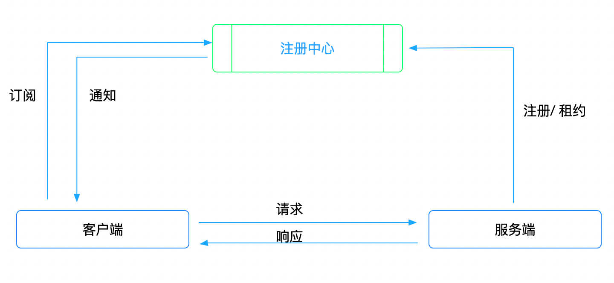

### 一、注册中心

为了高可用，生产环境我们的服务都是以集群的方式对外提供服务，集群的ip随时可能变化，比如重启，发布，扩容等。我们也就需要用一本 “通讯录”去保存和更新服务的节点，而这个通讯录就是注册中心，注册中心在整个微服务架构中是必要的。既然是微服务架构，那么必然有客户端和服务端。对于注册中心来说，服务端启动完成的时候注册服务，客户端就是订阅服务。



### 二、服务注册

在服务提供方启动的时候，应该通过某种形式（比如调用API、产生上线事件消息、在Etcd ，Zookeeper，数据库）把自己服务的信息通知给服务注册中心，注册中心将这个服务节点的IP和接口保存下来

### 三、服务订阅

在服务调用方启动的时候，去注册中心查找并订阅服务提供方的IP，然后缓存在缓存。其中这个过程是把一个服务标识（服务名）转化服务实际位置（ip地址）的过程。我们不仅需要根据客户端去查找服务而起我们也需要监听注册中心发生的事件(update,delete)更新本地的服务列表

### 四、gRPC的服务注册和发现

##### 1、注册中心的接口

注册中心我们采用Etcd，我们实现了 Registry 就实现了注册中心，Register 服务注册，UnRegister 服务的取消注册，这两个方法是服务端用的。ListServices 根据 serviceName 到注册中心获取服务，Subscribe 是注册中心发生事件通知服务端更新服务列表，这两个方法是客户端用的

```golang
type Registry interface {
   Register(ctx context.Context, si ServiceInstance) error
   UnRegister(ctx context.Context, si ServiceInstance) error
   ListServices(ctx context.Context, serviceName string) ([]ServiceInstance, error)
   Subscribe(serviceName string) (<-chan Event, error)
   io.Closer
}
```

##### 2、服务列表订阅

```golang
type ServiceInstance struct {
   Name    string
   Address string
   Weight  int32
   Group   string
}

type Event struct {
}
```

首先我们是基于 gRPC 服务注册与发现，gRPC 服务注册与发现的核心是resolver 包，下面是Grpc 核心的接口

##### 3、接口的实现

```golang
type Registry struct {
   c      *clientv3.Client //etcd
   sess   *concurrency.Session  //租约 
   canels []func()
   mutex  sync.Mutex
}

func NewRegistry(c *clientv3.Client) (*Registry, error) {
   session, err := concurrency.NewSession(c)
   if err != nil {
      return nil, err
   }
   return &Registry{
      c:    c,
      sess: session,
   }, nil
}

func (r *Registry) Register(ctx context.Context, si registry.ServiceInstance) error {
   marshal, err := json.Marshal(si) 
   if err != nil {
      return err
   }
  // 写入到etcd，并设置租约,客户端就可以自动续约
   _, err = r.c.Put(ctx, r.instanceKey(si), string(marshal), clientv3.WithLease(r.sess.Lease()))
   if err != nil {
      return err
   }
   return nil
}

func (r *Registry) UnRegister(ctx context.Context, si registry.ServiceInstance) error {
   _, err := r.c.Delete(ctx, r.instanceKey(si))
   if err != nil {
      return err
   }
   return nil
}

func (r *Registry) ListServices(ctx context.Context, serviceName string) ([]registry.ServiceInstance, error) {
   val, err := r.c.Get(ctx, r.ServiceKey(serviceName), clientv3.WithPrefix())
   if err != nil {
      return nil, err
   }
   res := make([]registry.ServiceInstance, 0, len(val.Kvs))
   for _, v := range val.Kvs {
      var t registry.ServiceInstance
      err := json.Unmarshal(v.Value, &t)
      if err != nil {
         continue
      }
      res = append(res, t)
   }
   return res, nil
}

func (r *Registry) Subscribe(serviceName string) (<-chan registry.Event, error) {
   ctx, cancel := context.WithCancel(context.Background())
   r.mutex.Lock()
   r.canels = append(r.canels, cancel)
   r.mutex.Unlock()
   defer cancel()
   ctx = clientv3.WithRequireLeader(ctx)
   re := r.c.Watch(ctx, r.ServiceKey(serviceName), clientv3.WithPrefix())
   res := make(chan registry.Event)
   go func() {
      for {
         select {
         case t := <-re:
            if t.Err() != nil {
               return
            }
            if t.Canceled {
               return
            }
            for range t.Events {
               res <- registry.Event{}
            }
         case <-ctx.Done():
            return
         }
      }
   }()
   return res, nil
}

func (r *Registry) Close() error {
   err := r.sess.Close()
   r.mutex.Lock()
   cancels := r.canels
   r.canels = nil
   r.mutex.Unlock()
   for _, cancel := range cancels {
      cancel()
   }
   return err
}

func (r *Registry) instanceKey(si registry.ServiceInstance) string {
   s := strings.Builder{}
   s.WriteString("/micro")
   s.WriteString("/" + si.Name)
   s.WriteString("/" + si.Address)
   return s.String()
}

func (r *Registry) ServiceKey(servername string) string {
   s := strings.Builder{}
   s.WriteString("/micro")
   s.WriteString("/" + servername)
   return s.String()
}
```

### 五、服务端服务注册

服务端服务注册是在启动服务的时候进行注册的，所以我们对server 进行了封装

```golang
type usermsg struct {
   gen.UnimplementedUserMesServiceServer
}

func (u usermsg) GetById(ctx context.Context, req *gen.GetByIdReq) (*gen.GetByIDResp, error) {
   return &gen.GetByIDResp{
      User: &gen.User{
         Id:   1,
         Name: "test",
      },
   }, nil
}

func TestUsermsg(t *testing.T) {
   us := &usermsg{}
   client, err2 := clientv3.New(clientv3.Config{
      Endpoints: []string{
         "127.0.0.1:2379",
      },
   })
   assert.NoError(t, err2)
   registry, err2 := etcd.NewRegistry(client)
   assert.NoError(t, err2)
   newServer, err2 := micro.NewServer("user-server",
      micro.WithServerRegistryOption(registry),
      micro.WithRegisterTimeOut(10*time.Second),
   )
   assert.NoError(t, err2)
   gen.RegisterUserMesServiceServer(newServer.Server, us)
   //server 
   newServer.Start("localhost:8082")
}
```

```golang
type Server struct {
   name            string
   register        registry.Registry
   registerTimeout time.Duration
   *grpc.Server
   //权重
   weight int32

   group string
}

type ServerOption func(server *Server)

func WithServerRegistryOption(registry registry.Registry) ServerOption {
   return func(server *Server) {
      server.register = registry
   }
}

func WithRegisterTimeOut(timeout time.Duration) ServerOption {
   return func(server *Server) {
      server.registerTimeout = timeout
   }
}

func WithRegisterWeight(weight int32) ServerOption {
   return func(server *Server) {
      server.weight = weight
   }
}

func WithRegisterGroup(group string) ServerOption {
   return func(server *Server) {
      server.group = group
   }
}

func NewServer(name string, opts ...ServerOption) (*Server, error) {
   t := &Server{
      name:   name,
      Server: grpc.NewServer(),
   }
   for _, o := range opts {
      o(t)
   }
   return t, nil
}

func (s *Server) Start(addr string) error {
   listen, err := net.Listen("tcp", addr)
   if err != nil {
      return err
   }
   if s.register != nil {
      ctx, cancel := context.WithTimeout(context.Background(), s.registerTimeout)
      defer cancel()
      err := s.register.Register(ctx, registry.ServiceInstance{
         Name:    s.name,
         Address: listen.Addr().String(),
         Weight:  s.weight,
         Group:   s.group,
      })
      if err != nil {
         return err
      }
   }
   err = s.Serve(listen)
   return err
}

func (s *Server) Close() error {
   if s.register != nil {
      err := s.register.Close()
      if err != nil {
         return err
      }
   }
   s.GracefulStop()
   return nil
}
```

### 六、服务的发现

gRPC提供了自定义的Resolver的能力实现服务发现的，所以我们只要实现 Resolver 就实现了客户端的服务发现，自定义的Resolver需要实现Builder接口。gRPC 对接口定义如下。

先说下 `Scheme()` 方法的作用，该方法返回一个stirng。注册的 `Resolver` 会被保存在一个全局的变量m中，m是一个map，这个map的key即为 `Scheme()` 方法返回的字符串。也就是多个Resolver是通过Scheme来进行区分的，所以我们定义 `Resolver` 的时候 `Scheme` 不要重复，否则 `Resolver` 就会被覆盖。

```golang
// Builder creates a resolver that will be used to watch name resolution updates.
type Builder interface {
   Build(target Target, cc ClientConn, opts BuildOptions) (Resolver, error)
   Scheme() string
}
```

那么我们实现Build 方法就可以完成客户端服务发现，代码如下：

```golang
type Builder struct {
   registry registry.Registry
   timeout  time.Duration
   close    chan struct{}
}

type itemConfigTimeout func(builder *Builder)

func WithItemConfigTimeout(timeout time.Duration) itemConfigTimeout {
   return func(builder *Builder) {
      builder.timeout = timeout
   }
}

func NewRegistryBuilder(r registry.Registry, opts ...itemConfigTimeout) (*Builder, error) {
   t := &Builder{
      registry: r,
      timeout:  10 * time.Second,
      close:    make(chan struct{}),
   }
   for _, opt := range opts {
      opt(t)
   }
   return t, nil
}

func (b *Builder) Build(target resolver.Target, cc resolver.ClientConn, opts resolver.BuildOptions) (resolver.Resolver, error) {
   re := &Resolver{
      t:         target,
      registry:  b.registry,
      cc:        cc,
      timeout:   b.timeout,
      close:     b.close,
      closeOnce: &sync.Once{},
   }
   re.ResolveNow(resolver.ResolveNowOptions{})
   go re.watch()
   return re, nil
}

func (b *Builder) Scheme() string {
   return "registry"
}

type Resolver struct {
   t         resolver.Target
   registry  registry.Registry
   cc        resolver.ClientConn
   timeout   time.Duration
   close     chan struct{}
   closeOnce *sync.Once
}

func (r *Resolver) ResolveNow(options resolver.ResolveNowOptions) {
   r.resolve()
}

func (r *Resolver) watch() error {
   subscribe, err := r.registry.Subscribe(r.t.Endpoint())
   if err != nil {
      return err
   }
   for {
      select {
      case <-subscribe:
         r.resolve()
      case <-r.close:
         return nil
      }
   }
}

func (r *Resolver) resolve() {
   ctx, cancel := context.WithTimeout(context.Background(), r.timeout)
   defer cancel()
   servicesInstance, err := r.registry.ListServices(ctx, r.t.Endpoint())
   if err != nil {
      r.cc.ReportError(err)
   }
   re := make([]resolver.Address, 0, len(servicesInstance))
   for _, add := range servicesInstance {
      re = append(re, resolver.Address{Addr: add.Address, Attributes: weight})
   }
   state := resolver.State{Addresses: re}
   err = r.cc.UpdateState(state)
   if err != nil {
      r.cc.ReportError(err)
   }
}

func (r *Resolver) Close() {
   r.closeOnce.Do(func() {
      close(r.close)
   })
}
```

### 七、client 端与Build 结合实现服务发现，完成一次gRPC 请求

```golang
client, err := clientv3.New(clientv3.Config{
   Endpoints: []string{
      "127.0.0.1:2379",
   },
})
assert.NoError(t, err)
registry, err3 := etcd.NewRegistry(client)
assert.NoError(t, err3)
builder, err2 := NewRegistryBuilder(registry, WithItemConfigTimeout(20*time.Second))
assert.NoError(t, err2)
dial, err := grpc.Dial("registry://user-server", grpc.WithInsecure(),
   grpc.WithResolvers(builder),
)
assert.NoError(t, err)
clien := gen.NewUserMesServiceClient(dial)
ctx, cancel := context.WithTimeout(context.Background(), 10000*time.Second)
defer cancel()
ctx = context.WithValue(ctx, "group", "A")
res, err := clien.GetById(ctx, &gen.GetByIdReq{Id: 12323})
assert.NoError(t, err)
fmt.Println(res)
```

### 八、gRPC 是怎么实现的，深入底层源码讲解

```golang
func DialContext(ctx context.Context, target string, opts ...DialOption) (conn *ClientConn, err error) {
   //这册一个http2.0的调用,此时并没有调用，而是注册一个回掉函数,等到找到了Resolver的时候完成回掉发送一次http2.0 的请求
   cc.csMgr = newConnectivityStateManager(cc.ctx, cc.channelzID)
   //根据 Scheme 找到对应的 resolver,如果多个resolver，他们的Scheme相同就可能被覆盖
   if err := cc.parseTargetAndFindResolver(); err != nil {
      return nil, err
   }
   // 通过找到 parseTargetAndFindResolver找到resolver 完成方法调用，最终发送一次http2.0 的请求最终
   if err := cc.exitIdleMode(); err != nil {
      return nil, err
   }
}
```